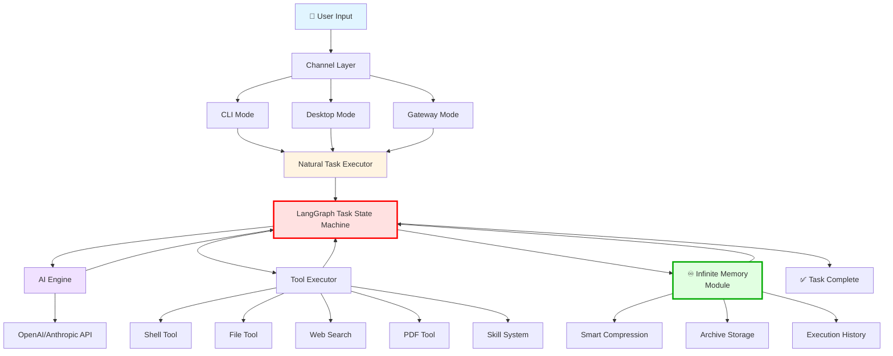

# 🤖 麒麟OS-Agent

<div align="center">


**[English](README.md) | [中文](README.zh.md)**

  

An ultra-lightweight AI automation tool with original SuperAgent architecture that executes tasks through natural language interaction.

[Features](#-key-features) • [Installation](#-installation) • [Screenshots](#-demo-screenshots) • [Documentation](#-documentation)

</div>

---

## ✨ Overview

麒麟OS-Agent is an ultra-lightweight AI automation tool with original SuperAgent architecture that executes tasks through natural language interaction in the terminal.

## 🏗️ Architecture

CLI, desktop, and gateway modes now share one LangGraph task state machine.
LangChain supplies standard model/message abstractions, while the existing
provider transport, tools, approvals, memory, and UI event protocol remain
project-owned. SQLite checkpoints preserve question/approval interrupts
without storing private reasoning.



**🔥 Core Innovations:**

- **LangGraph Task State Machine**: The runtime plans, executes, interrupts, resumes, and finishes through explicit graph states
  - Analyze current state → Plan next step → Execute tool → Verify result → Continue or finish

- **♾️ Infinite Memory Module**: Revolutionary compression system for unlimited context
  - **Smart Compression**: 97% token reduction (30,000 → 1,000 tokens)
  - **Pointer-based Storage**: Archives complete history, accessible anytime
  - **Three-tier Memory**: Current task → Accumulated compression → Timestamped archives

**Core Components:**
- **Channel Layer**: Multi-mode interaction (CLI/Desktop/Gateway)
- **Natural Task Executor**: Orchestrates multi-step task planning
- **AI Engine**: Communicates with LLM APIs for reasoning
- **Tool Executor**: Executes 20+ built-in tools
- **Skill System**: Modular knowledge extensions

## 🌟 Key Features

<details>
<summary><b>🚀 Core Capabilities</b></summary>

- 🤖 **Natural Language Interaction** - Describe tasks in natural language
- 🔧 **System Command Execution** - Execute shell commands safely
- 📁 **File Operations** - Read, write, copy, move, delete files
- 📄 **Document Parsing** - Support PDF, Word, Markdown, JSON formats
- 🔍 **Web Search** - Search the web using Tavily API
- 🌐 **URL Content Reading** - Automatically extract web page content
- ⏰ **Timer** - Set scheduled tasks

</details>

<details>
<summary><b>🎯 Advanced Features</b></summary>

- ✅ **Command Approval** - Interactive command confirmation
- 📤 **File Sending** - Send files to Feishu (Gateway Mode)
- 💬 **Feishu Integration** - Real-time task progress updates
- 🖥️ **Desktop UI** - Beautiful graphical interface
- 🎓 **Skill System** - Modular knowledge base with 6+ built-in skills
- 🔄 **Smart Tool Loading** - AI consciously loads tools as needed
- 🧠 **Memory Compression** - Unlimited context with intelligent compression
- ⚡ **24/7 Operation** - Supports long-running processes

</details>

## 💡 Why 麒麟OS-Agent?

| Feature | Traditional AI | 麒麟OS-Agent |
|---------|----------------|---------|
| **Capability** | Chat only | Execute real tasks |
| **Control** | Conversation | Control server & execute commands |
| **Context** | Limited sessions | Unlimited with compression |
| **Planning** | Single response | AI automated multi-step planning |
| **Interface** | Web / App only | CLI / Desktop / Gateway |

**麒麟OS-Agent bridges the gap** - Not just chatting, but actually **controlling your server** and executing tasks autonomously.

## Installation

### Requirements

- Python 3.11 or newer
- LangChain 1.2.7 and LangGraph 1.0.7 for the shared agent runtime
- LangGraph SQLite checkpointer 3.1.0 for persistent task state

The supported framework versions are pinned in `requirements.txt` and
`setup.py` so CLI, desktop, and gateway installations use the same runtime.

### Install from Source

```bash
git clone https://github.com/chuanchuan123321/麒麟OS-Agent.git
cd 麒麟OS-Agent
pip install -e .
```

## 📸 Demo Screenshots

### CLI Mode
<p align="center">
  
</p>

### Desktop Mode
<p align="center">
  
</p>

### Gateway Mode (Feishu)
<p align="center">
  
</p>

## 🚀 Quick Start

### 1️⃣ Configure Environment Variables

Copy `.env.example` to `.env` and fill in your API credentials:

```bash
cp .env.example .env
```

Edit `.env` file with your API keys:

```bash
# Using OpenAI API (Recommended)
API_BASE_URL=https://api.openai.com/v1
API_KEY=sk-your_openai_api_key_here
API_MODEL=gpt-5.2

# Or use other API services (e.g., Anthropic, domestic services, etc.)
# API_BASE_URL=https://api.anthropic.com
# API_KEY=your_api_key_here
# API_MODEL=claude-sonnet-4-5-20250929

# Or use domestic API services
# API_BASE_URL=https://yunwu.ai
# API_KEY=your_api_key_here
# API_MODEL=claude-sonnet-4-5-20250929

TAVILY_API_KEY=tvly-your_tavily_api_key_here
MAX_TOKENS=4096
TEMPERATURE=0.7
```

**Supported API Services:**
- ✅ OpenAI (https://api.openai.com/v1)
- ✅ Anthropic (https://api.anthropic.com)
- ✅ Domestic API Services (e.g., yunwu.ai)
- ✅ Other OpenAI-compatible APIs

### 2️⃣ Run 麒麟OS-Agent

Choose your preferred mode:

```bash
# CLI Mode (Default)
python chat.py

# Desktop Mode (GUI)
python chat.py desktop

# Gateway Mode (Feishu Integration)
python chat.py gateway
```

### 3️⃣ Gateway Mode (Feishu Integration)

Run in gateway mode to receive tasks from Feishu and send real-time updates:

```bash
python chat.py gateway
```

**Gateway Mode Features:**
- 📨 Receive tasks from Feishu
- 🤖 Real-time progress updates
- 📤 Send files directly to Feishu
- ✅ Interactive command approval via Feishu

**Setup:**
1. Configure Feishu credentials in `.env` file:
   ```bash
   FEISHU_ENABLED=true
   FEISHU_APP_ID=your_app_id
   FEISHU_APP_SECRET=your_app_secret
   ```
2. Enable Bot capability in Feishu Open Platform
3. Subscribe to `im.message.receive_v1` event
4. Run: `python chat.py gateway`

### 4️⃣ Desktop Mode (Graphical Interface)

Run in desktop mode for a beautiful graphical interface with real-time monitoring:

```bash
python chat.py desktop
```

**Desktop Mode Features:**
- 🖥️ Modern, lightweight UI with sidebar navigation
- 🌓 Light/dark themes, responsive layout, and keyboard accessibility
- ⏹️ Reliable stop handling, a client-side task queue, and clear status feedback
- 📊 Real-time token usage monitoring with visual indicator
- 📁 Workspace file browser (output/temp folders)
- 🧠 Memory file viewer (execution_history.md, accumulated_compression.md)
- 🎯 Skills management (add, view, delete custom skills)
- ⚙️ In-app settings editor (modify API keys, model, parameters)
- ✅ Visual command approval dialog
- 💬 Chat interface with thinking steps and tool execution results

The desktop app uses a Chrome application window by default. To open it in the
system browser instead:

```bash
MINIBOT_DESKTOP_MODE=browser python chat.py desktop
```

**Desktop UI Components:**
- **Chat Area**: Main conversation interface with message bubbles
- **Token Indicator**: Shows current memory usage vs. compression threshold
- **Sidebar**: Workspace files, memory files, and skills management
- **Settings Modal**: Configure API keys, model, max steps, tokens, etc.
- **Quick Commands**: Support for `/clear` and `/compact` commands

**Configuration in Desktop Mode:**
Click the Settings button (⚙️) in the sidebar to configure:
- API Base URL, API Key, API Model
- Tavily API Key
- Max Steps (default: 20)
- Max Tokens (default: 30000)
- Compress At threshold (default: 25000)
- Max Web Searches (default: 3)

## 📚 Usage Examples

### Example 1: Web Search

```
You: Search for the latest AI technology developments

Next I will: Use web_search tool to search for latest AI technology

===== JSON START =====
{"action": "execute_tool", "tool": "web_search", "params": {"query": "latest AI technology 2025"}}
===== JSON END =====
```

### Example 2: File Operations

```
You: Create a config.json file with application configuration

Next I will: Create configuration file

===== JSON START =====
{"action": "execute_tool", "tool": "file_write", "params": {"path": "/path/to/config.json", "content": "{\"app_name\": \"MyApp\", \"version\": \"1.0.0\", \"debug\": true}"}}
===== JSON END =====
```

### Example 3: Multi-step Workflow

```
You: Create a project with src, tests directories and main.py

Next I will: Create project directories and main.py file

===== JSON START =====
{"action": "execute_tool", "tool": "dir_create", "params": {"path": "/path/to/project/src"}}
===== JSON END =====

(AI continues to create tests directory and main.py...)
```

## 🛠️ Available Tools

| Tool Name | Description | Parameters |
|-----------|-------------|-----------|
| `shell` | Execute system commands | `command` |
| `file_read` | Read text files | `path` |
| `file_write` | Write files | `path`, `content` |
| `file_list` | List directory files | `path` |
| `file_delete` | Delete files | `path` |
| `dir_create` | Create directories | `path` |
| `dir_change` | Change working directory | `path` |
| `read_pdf` | Read PDF/Word documents | `path` |
| `read_markdown` | Read Markdown files | `path` |
| `read_json` | Read JSON files | `path` |
| `search_files` | Search for files by pattern | `pattern`, `path` |
| `get_file_info` | Get file information | `path` |
| `copy_file` | Copy files | `source`, `destination` |
| `move_file` | Move/rename files | `source`, `destination` |
| `create_file` | Create new files | `path`, `content` |
| `web_search` | Search the web | `query` |
| `read_url` | Read URL content | `url` |
| `set_timer` | Set timer | `minutes`, `message` |
| `send_file` | Send file to Feishu | `path` (Gateway Mode only) |
| `generate_pdf` | Generate PDF from documents | `input_path`, `output_path`, `format` |
| `load_skill` | Load skill's complete content | `skill_name` |

## ⚙️ Configuration

### API Configuration

| Parameter | Description |
|-----------|-------------|
| `API_BASE_URL` | Base URL of the AI API |
| `API_KEY` | API key |
| `API_MODEL` | Model name to use |
| `TAVILY_API_KEY` | Tavily search API key |

### Execution Configuration

| Parameter | Default | Description |
|-----------|---------|-------------|
| `MAX_TOKENS` | 30000 | Maximum tokens per response |
| `TEMPERATURE` | 0.7 | AI creativity (0-1) |
| `MAX_STEPS` | 20 | Maximum execution steps per task |
| `COMPRESS_AT` | 25000 | Token threshold for auto-compression |
| `MAX_WEB_SEARCHES` | 3 | Maximum web searches per task |

### Command Reference

| Command | Mode | Function |
|---------|------|----------|
| `/clear` | CLI, Gateway, Desktop | Clear conversation and execution history |
| `/compact` | CLI, Gateway, Desktop | Manually compress memory |
| `/stop` | Gateway Mode | Stop the currently executing task |
| `Ctrl+C` | CLI | Interrupt current task |
| `exit` / `quit` | CLI | Exit the program |

## 📁 Project Structure

```
麒麟OS-Agent/
├── agent/
│   ├── core/
│   │   ├── ai_engine.py              # AI Engine
│   │   ├── extended_tool_executor.py # Tool Executor
│   │   ├── skills.py                 # Skills Loader
│   │   └── memory_manager.py         # Memory Manager
│   ├── tools/
│   │   ├── shell.py                  # Shell Command Tool
│   │   ├── file.py                   # File Operations Tool
│   │   ├── time_tool.py              # Timer Tool
│   │   ├── pdf_tool.py               # PDF Generation Tool
│   │   └── skill_tool.py             # Skill Loading Tool
│   ├── channels/
│   │   ├── base.py                   # Base Channel Class
│   │   ├── feishu.py                 # Feishu Integration
│   │   └── manager.py                # Channel Manager
│   ├── bus/
│   │   ├── queue.py                  # Message Queue
│   │   └── events.py                 # Event Definitions
│   ├── config/
│   │   ├── loader.py                 # Config Loader
│   │   └── schema.py                 # Config Schema
│   ├── skills/                       # Built-in Skills
│   │   ├── github/
│   │   ├── web/
│   │   ├── python/
│   │   ├── project-setup/
│   │   └── skill-creator/
│   └── ui/
│       ├── cli.py                    # CLI Interface
│       └── desktop/                  # Desktop UI
│           ├── main.py               # Eel backend (Python)
│           ├── index.html            # UI layout
│           ├── app.js                # Frontend logic
│           └── styles.css            # Light minimal theme
├── Memory/
│   ├── execution_history.md          # Current task execution history
│   ├── accumulated_compression.md    # Compressed summaries of previous tasks
│   ├── index.json                    # Compression record index
│   └── YYYY-MM-DD/                   # Date-based archive folders
│       └── YYYY-MM-DD_HH-MM-SS_历史.md # Timestamped archives
├── workspace/
│   ├── output/                       # Final output files (preserved)
│   ├── temp/                         # Temporary files (auto-cleaned)
│   ├── cache/                        # Cache data
│   └── skills/                       # Custom user skills
├── images/                           # Demo screenshots
│   └── demo.png                      # Interface screenshot
├── chat.py                           # Main program
├── setup.py                          # Installation configuration
├── requirements.txt                  # Dependencies list
├── .env.example                      # Environment variables example
├── .gitignore                        # Git ignore file
├── CLAUDE.md                         # Claude Code guidance
├── LICENSE                           # MIT License
└── README.md                         # This file
```

## 🧠 Memory System Architecture

麒麟OS-Agent features an intelligent multi-level memory system designed for efficient context management across long-running tasks:

### Memory Structure

**Three-tier storage strategy:**

1. **Current Task History** (`execution_history.md`)
   - Stores real-time execution steps of the current task
   - Records: user requests, AI responses, tool execution results
   - Appended incrementally during task execution
   - Cleared after compression

2. **Accumulated Compression** (`accumulated_compression.md`)
   - Maintains compressed summaries of all previous tasks
   - Enables AI to understand historical context
   - Grows progressively as more tasks are compressed
   - Available to all subsequent tasks

3. **Timestamped Archives** (`Memory/YYYY-MM-DD/`)
   - Permanently stores complete execution history
   - Organized by date with minute-level precision
   - Enables task history lookup and audit trails

### Memory Flow

```
Task Execution:
  1. Load accumulated_compression (previous task summaries)
  2. Append steps to execution_history as they execute
  3. AI references both for decision-making

Task Completion:
  1. Compress execution_history to summary (table format)
  2. Archive complete history with timestamp
  3. Append summary to accumulated_compression
  4. Clear execution_history for next task

Next Task:
  1. Load accumulated_compression (now includes latest summary)
  2. Start fresh execution_history
  3. Continue cycle...
```

### Key Features

- **Persistent Context** - Previous task summaries inform current decisions
- **Automatic Cleanup** - Execution history cleared after compression
- **Temporal Organization** - Archives timestamped for historical reference
- **Token Efficiency** - System prompts not stored, only user context and results
- **Scalable Design** - Supports unlimited task chaining without context loss

### Unlimited Context with Smart Compression

麒麟OS-Agent achieves **unlimited context capacity** through an intelligent compression mechanism:

**How It Works:**

1. **Automatic Compression** (Manual via `/compact` command)
   - When task execution history exceeds 30,000 tokens, automatic compression is triggered
   - Or manually trigger with `/compact` command at any time
   - Execution history is intelligently compressed into ~1,000 tokens summary
   - Complete history is archived with timestamp and referenced by pointer

2. **Pointer-based Memory Storage**
   - Compressed summaries stored with pointers to complete archived history
   - Each task stores: compressed summary (~1,000 tokens) + pointer to full archive
   - No information loss - complete history always accessible via pointer
   - Accumulated compression chain builds up with task references only

3. **Benefits**

   | Scenario | Without Compression | With Compression |
   |----------|-------------------|------------------|
   | 10 task chain | Context overloaded | ✅ All tasks remembered |
   | 100 task chain | Impossible | ✅ Unlimited tasks supported |
   | Compression ratio | N/A | ✅ 30,000 tokens → ~1,000 tokens (97% reduction) |
   | Historical recall | Lost after few tasks | ✅ Full project memory accessible via pointers |

**Using the `/compact` Command:**

```bash
# Manual compression (CLI mode)
> /compact
📊 近期记忆: 28,500 tokens，正在压缩...
✅ 历史记录已压缩并保存到记忆文件

# Or in Gateway Mode
> /compact
✅ 历史记录已压缩，可继续提问
```

**Result:**
- Task execution history is cleared
- Compressed summary is archived
- Previous task context is accumulated for next task
- System can handle unlimited task sequences

## 🎓 Skill System

麒麟OS-Agent includes a powerful skill system for modular knowledge management:

### What are Skills?

Skills are reusable knowledge modules that teach AI about specific domains, tools, or best practices. Each skill contains:
- **SKILL.md** - Comprehensive guide with instructions and examples
- **scripts/** - Python/shell scripts for automation
- **data/** - CSV databases for searching and recommendations

### Built-in Skills

- **web** - Web search techniques and best practices
- **github** - GitHub CLI usage guide
- **python** - Python programming best practices
- **pdf** - PDF processing and manipulation
- **docx** - Word document creation and editing
- **ui-ux-pro-max** - UI/UX design intelligence with 50+ styles and 97 color palettes

### Using Skills

1. **View Available Skills** - AI sees all skills in the system information
2. **Load Skill** - AI calls `load_skill("skill-name")` to get detailed guidance
3. **Get Recommendations** - AI uses skill data for intelligent suggestions

### Creating Custom Skills

Create a new skill in `workspace/skills/`:

```bash
mkdir -p workspace/skills/my-skill
cat > workspace/skills/my-skill/SKILL.md << 'EOF'
---
name: my-skill
description: "My custom skill description"
requires_bins: python
requires_env:
---

# My Skill

Detailed content and instructions...
EOF
```

### File Management

麒麟OS-Agent automatically manages files in organized directories:

```
workspace/
├── output/     # Final output files (preserved)
├── temp/       # Temporary files (auto-cleaned)
├── cache/      # Cache data (optional cleanup)
└── skills/     # Skill modules
```

**Rules:**
- Final output → `workspace/output/`
- Temporary files → `workspace/temp/` (auto-cleaned after task)
- Cache data → `workspace/cache/`
- System info includes all paths for AI guidance

## 🤝 Contributing

Contributions are welcome! Please feel free to submit Issues and Pull Requests.

## 📄 License

This project is licensed under the MIT License - see the [LICENSE](LICENSE) file for details.

## 📞 Contact

Email: 2774421277@qq.com

---

<div align="center">

**⭐ If you find this project helpful, please consider giving it a star!**

</div>
