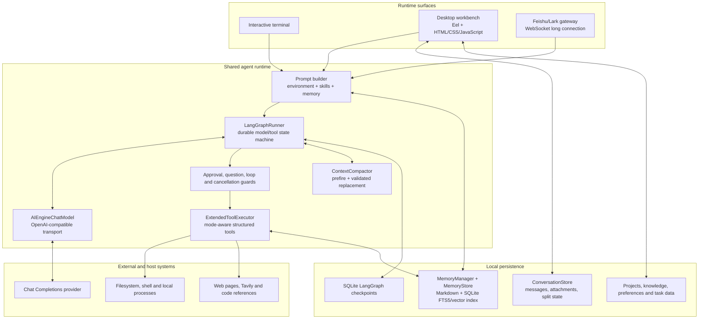
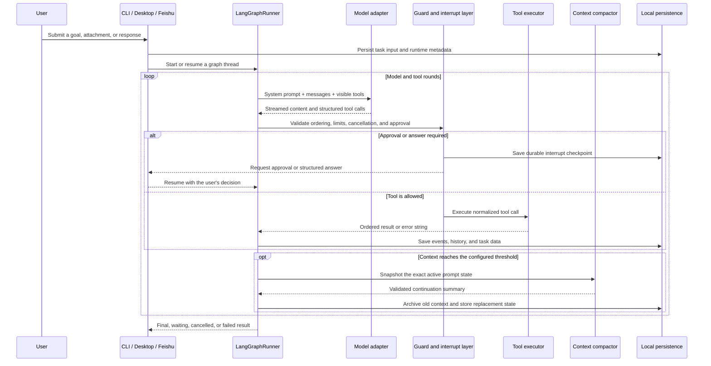
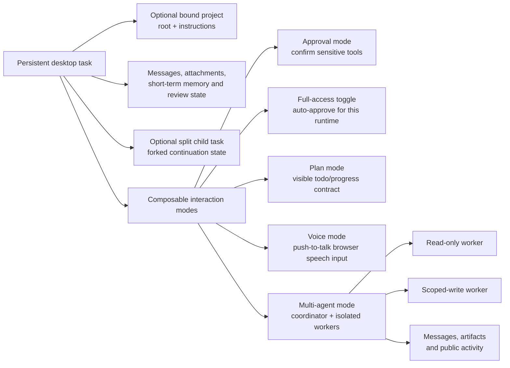
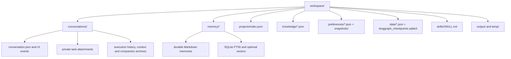

# JCodex

<div align="center">
  
  <p><strong>A local-first AI coding, research, and system-automation workspace.</strong></p>
  <p>
    <a href="README.md">English</a> ·
    <a href="README.zh.md">简体中文</a>
  </p>
  <p>
    
    
    
  </p>
</div>

JCodex turns a natural-language goal into an observable, resumable execution workflow. It can inspect and modify local projects, run commands, search code and the web, process documents and images, maintain plans, coordinate isolated child agents, preserve project memory, and present the entire run through a terminal, a desktop workbench, or a Feishu/Lark bot.

This repository is more than a chat wrapper. Its core is a durable LangGraph model/tool loop with explicit approval and question interrupts, a mode-aware tool inventory, context compaction, project-scoped persistence, local preview management, and several complementary knowledge systems.

> [!WARNING]
> JCodex can execute commands and change files on the host machine. Approval mode is a human-control layer, not an operating-system sandbox. Use trusted workspaces, review requested actions, and protect your `.env` file.

## Why JCodex

- **One execution core, three runtime surfaces**: terminal, desktop, and Feishu/Lark gateway runs share the same model adapter, tool executor, LangGraph state machine, compaction policy, and memory pipeline.
- **A real desktop workbench**: persistent tasks, bound project folders, split tasks, file and memory browsers, skills management, change review, image/folder attachments, local Web previews, settings, knowledge, preferences, and data inspection.
- **Several task interaction modes**: normal approval mode, one-click full-access mode, plan mode, voice mode, multi-agent collaboration, and persistent split-task workspaces can be selected independently where supported.
- **Durable human-in-the-loop execution**: command approvals and structured questions pause the graph at a checkpoint and resume the same task after the user responds.
- **Context that scales**: percentage-based prefire and full-replacement compaction keep long runs under the provider context window without conflating short-term continuation state with long-term memory.
- **Local, layered memory**: short-term task files, SQLite FTS5/BM25 retrieval, optional embeddings, a structured knowledge base, preference versioning, and execution-data integration serve different persistence needs.
- **Extensible by files, not only code**: built-in and workspace `SKILL.md` packages can add procedures, scripts, and dependency requirements without changing the agent loop.
- **Designed for visible work**: streamed reasoning status, ordered tool events, plans, approvals, child-agent activity, diffs, preview lifecycle, token usage, and compaction progress are projected into stable UI events.

## Capability Map

| Area | What is implemented |
| --- | --- |
| Coding and local automation | Shell execution, bounded file reads, exact edits, writes, file discovery, content search, background tasks, output monitoring, and cancellation |
| Research | Tavily Web search, programming-reference search, URL fetching, and source content extraction |
| Documents and media | PDF/Word/Excel-aware reads, PDF generation, Markdown/JSON handling, and task-scoped PNG/JPEG/WebP image inspection |
| Task control | Step limits, Web-search limits, loop detection, plans/todos, user questions, approvals, cancellation, timers, and scheduled prompts |
| Desktop workspace | Persistent conversations, project binding, split panes, message queue, attachments, file browser, memory browser, skills browser, settings, token/embedding status, and dark mode |
| Review and preview | Per-task modified-file tracking, unified change-review panel, managed loopback-only Web servers, embedded preview, logs, readiness checks, and process cleanup |
| Memory and knowledge | Short-term execution history, accumulated compaction summaries, hybrid long-term search, knowledge entries/conflicts, preferences/snapshots, and normalized task data |
| Collaboration | Up to four isolated child agents, dependency ordering, scoped write ownership, inbox messages, shared artifacts, a public collaboration blackboard, cancellation, and result synthesis |
| Remote access | Feishu/Lark WebSocket gateway with per-chat isolation, progress delivery, interrupt/resume handling, file sending, `/stop`, `/clear`, and `/compact` |

## Architecture

### System overview



### One task run



The runner processes model-selected tools in order, even when a provider returns several calls in one response. Checkpoints are keyed by task/thread, while each user submission has a separate run identifier. The UI receives normalized public events rather than direct access to graph internals.

### Desktop tasks and modes



Modes are not separate executables. They change the prompt policy, visible tool schemas, approval behavior, or UI interaction for a desktop task. Plan tools are hidden outside plan mode; question tools are hidden in voice mode; collaboration tools are hidden unless multi-agent mode is enabled.

### Local data model



The systems deliberately have different responsibilities:

- **Conversation storage** reconstructs desktop UI state and task history.
- **Short-term memory** continues one task and stores compaction artifacts.
- **Long-term memory** retrieves reusable global, workspace, and session knowledge.
- **Knowledge base** stores typed, versioned entries and conflict metadata.
- **Preferences** store versioned user operating and output choices with snapshots.
- **Data integration** normalizes tool results, user events, configuration, and task records for inspection.

## Runtime Surfaces

### Terminal

```bash
python chat.py
```

The terminal is the lightest interface and is useful for direct local automation or SSH sessions.

| Command | Behavior |
| --- | --- |
| `/clear` | Clears the current CLI execution history and memory context |
| `/compact` | Runs manual compaction over accumulated task history |
| `exit` or `quit` | Closes the terminal session |
| `Ctrl+C` | Cancels the active graph/tool run but keeps JCodex open |

Installing the project with `pip install -e .` also provides `os-agent`, which starts the terminal interface.

### Desktop workbench

```bash
python chat.py desktop
```

The desktop runtime binds to `127.0.0.1`, chooses the configured port or the next available one, and normally opens a Chrome application window. Supported launch modes:

```bash
# Open in the default system browser
MINIBOT_DESKTOP_MODE=browser python chat.py desktop

# Start the local server without opening a window
MINIBOT_DESKTOP_MODE=server python chat.py desktop
```

Desktop-specific workflows include:

- Create persistent ordinary tasks or bind an existing local directory as a project.
- Add project-level instructions; JCodex also discovers files such as `AGENTS.md`, `README.md`, `CONTRIBUTING.md`, `pyproject.toml`, and `package.json`.
- Drop supported files, images, or explicit local folder references into a task.
- Queue messages while a task is running, stop execution, clear history, or manually compact context.
- Open a persistent split child task beside the primary task; width and visibility are stored.
- Inspect output/temp files, short-term memory files, skills, token usage, and embedding status.
- Review modified files in an integrated diff panel.
- Start a managed local Web preview and open it embedded or in an external browser.
- Manage API profiles, runtime limits, preferences, normalized data, and structured knowledge.

### Feishu/Lark gateway

```bash
python chat.py gateway
```

The gateway uses the official Lark SDK and a WebSocket long connection, so it does not require a public webhook endpoint. Each chat receives isolated active-task, pending-interrupt, memory, and task-data state.

Required environment values:

```dotenv
FEISHU_ENABLED=true
FEISHU_APP_ID=your_app_id
FEISHU_APP_SECRET=your_app_secret

# Optional when configured in Feishu Open Platform
FEISHU_ENCRYPT_KEY=
FEISHU_VERIFICATION_TOKEN=
```

Enable bot capability and subscribe to `im.message.receive_v1` in Feishu Open Platform. Gateway commands:

| Command | Behavior |
| --- | --- |
| `/stop` | Cancels the active or queued task for that chat |
| `/clear` | Clears only that chat's history and pending execution state |
| `/compact` | Compacts only that chat's accumulated memory |

Gateway-only tool schemas, such as file delivery, are not exposed in local modes.

## Interaction Modes

### Approval and full-access modes

Desktop tasks default to an approval-oriented workflow. Shell commands, writes, edits, generated files, previews, file delivery, and write-enabled child agents can interrupt the graph for confirmation. The access toggle can auto-approve subsequent actions.

Use full access deliberately: it removes repeated UI confirmation but does not add sandboxing or path isolation to the primary agent.

### Plan mode

Plan mode exposes `todo_write` and `update_plan`, injects a planning policy into the prompt, and renders a stable task-progress component. It is intended for multi-step implementation and investigation where the user needs a visible contract, not merely a prose plan.

### Voice mode

Voice mode provides push-to-talk input in the desktop overlay using browser speech-recognition support. Recognized text is shown before submission. Since a voice interaction should not block on click-heavy structured questions, question tools are removed from that run's visible tool inventory.

### Split-task mode

A primary desktop task can create one persistent internal child conversation in a resizable side pane. The child receives forked continuation memory at creation, then evolves independently. Deleting the split task also removes its private conversation state and related checkpoints.

### Multi-agent collaboration

Multi-agent mode gives the primary model coordinator tools for creating and supervising up to four child agents.

- Each child has a separate model history, LangGraph runner, cancellation event, inbox, activity stream, and bounded public result.
- Children do not inherit the parent's full private conversation. They receive an explicit task, role, context, work directory, dependencies, and optional write paths.
- Read-only children can inspect and research. Write-enabled children receive only `edit`/`write` for coordinator-assigned, non-overlapping roots; shell access is not exposed to scoped writers.
- Children cannot recursively create more agents.
- Agents can exchange directed messages and publish shared artifacts to the collaboration blackboard.
- The primary agent remains responsible for integration, final verification, and the answer returned to the user.

## Core Execution Components

| Component | Responsibility |
| --- | --- |
| `AIEngine` | OpenAI-compatible Chat Completions transport, URL normalization, retries, SSE streaming, reasoning/tool-delta assembly, and provider response parsing |
| `AIEngineChatModel` | LangChain `BaseChatModel` adapter that keeps the existing provider transport while supporting LangGraph tool binding |
| `LangGraphRunner` | Ordered model/tool loop, durable state, interrupt/resume, cancellation, step gates, finish guards, and normalized events |
| `ExtendedToolExecutor` | Structured tool definitions, aliases, dispatch, path/scope validation, background tasks, attachments, skills, schedules, memory tools, and previews |
| `ToolLoopGuard` | Detects repeated or unproductive tool calls before they consume the whole step budget |
| `ContextCompactor` | Exact prompt snapshots, token estimation, prefire summaries, two-pass compaction, validation, archival, and full context replacement |
| `ConversationStore` | Atomic persistent desktop tasks, messages, attachments, split state, completion state, and task-local memory paths |
| `MemoryStore` | Markdown-backed long-term memory with SQLite FTS5/BM25, optional embeddings, recency weighting, deduplication, and optional MMR |
| `MultiAgentTeam` | Thread-safe child lifecycle, dependencies, inboxes, artifacts, public activity, write ownership, waiting, and cancellation |
| `PreviewManager` | Persistent loopback Web processes, sanitized environment, injected host/port, readiness checks, bounded logs, and descendant cleanup |

## Tools

The model sees JSON-schema function tools. The exact inventory is filtered by runtime and interaction mode.

| Group | Primary tools | Notes |
| --- | --- | --- |
| Files and code | `read`, `glob`, `grep`, `edit`, `write`, `list_dir` | `read` understands text, PDF, Word, and Excel; large text reads are line-bounded |
| Commands and processes | `bash`, `monitor`, `get_task_output`, `kill_task` | Supports foreground and background processes with cancellation and output polling |
| Research | `websearch`, `codesearch`, `read_url` | Tavily is optional; Web-search calls are counted per task |
| Media and documents | `view_image`, `generate_pdf` | Images are restricted to task attachments or allowed workspace output/temp paths |
| Planning and interaction | `todo_write`, `update_plan`, `question` | Visibility depends on plan/voice mode; questions create resumable interrupts |
| Memory and discovery | `memory_search`, `memory_get`, `search_tool`, `use_tool`, `load_skill` | Supports progressive tool and skill discovery instead of a permanently huge prompt |
| Time and automation | `set_timer`, `scheduler_create`, `scheduler_list`, `scheduler_delete`, `update_goal` | In-process schedules trigger configured prompt callbacks while the runtime remains active |
| Preview | `project_preview` | Starts only loopback-bound Web previews and waits for HTTP readiness |
| Collaboration | `spawn_agent`, `list_agents`, `wait_agents`, `send_agent_message`, `publish_agent_artifact`, `get_agent_collaboration`, `cancel_agent` | Desktop multi-agent mode only |
| Gateway | `send_file` | Exposed only when an active gateway channel can route the file |

Legacy aliases remain registered so older persisted checkpoints can still resume, while the normal model inventory uses the preferred names.

## Memory, Compaction, Knowledge, and Preferences

### Context compaction

Compaction is continuation state, not long-term memory. The compactor:

1. Builds a snapshot from the system prompt, messages, tool calls/results, and active tool schemas.
2. Starts speculative prefire work before the hard trigger when configured.
3. At `AUTO_COMPACT_THRESHOLD_PERCENT`, generates and validates a structured continuation summary.
4. Replaces the older graph context while preserving current instructions and audit metadata.
5. Archives the replaced transcript and reports tokens before/after to the UI.

Two-pass compaction is enabled by default. Manual `/compact` uses the same shared mechanism.

### Long-term memory

`MemoryStore` chunks Markdown records into a workspace-specific SQLite index. Retrieval combines text relevance, optional vector similarity, source weighting, and time decay. Configure an OpenAI-compatible embedding endpoint to enable semantic retrieval; without it, FTS5/BM25 remains functional.

Desktop project tasks share a project memory scope. Ordinary tasks use isolated scopes. Feishu sessions are separated by channel/chat identity.

### Knowledge, preferences, and task data

These are intentionally separate from automatic long-term retrieval:

- The **knowledge base** stores typed facts, workflows, cases, templates, rules, provenance, confidence, versions, related entries, and conflict records.
- The **preference manager** stores operation, output, security, behavior, workflow, or custom preferences with history and snapshots.
- The **data integrator** normalizes tool results, user behavior, configuration, AI responses, and task status into inspectable records.

## Skills

A skill is a directory containing a `SKILL.md` file and optional scripts or supporting data.

```text
workspace/skills/my-skill/
├── SKILL.md
├── scripts/
└── data/
```

JCodex scans two locations:

- `agent/skills/` for built-in skills
- `workspace/skills/` for local skills; a local skill with the same name overrides the built-in one

Skill frontmatter provides the name, description, optional `always` behavior, and dependency requirements. The base prompt receives only a compact skill catalog; full instructions are loaded on demand with `load_skill`. The desktop UI can import, inspect, refresh, open, and delete workspace skills.

## Installation

### Requirements

- Python 3.11 or newer
- A provider implementing OpenAI-compatible Chat Completions, native function/tool calls, and preferably SSE streaming
- Chrome/Chromium for the default desktop application-window mode
- Optional: Tavily API key for public Web search
- Optional: Feishu/Lark application credentials for gateway mode
- Optional: an OpenAI-compatible embedding endpoint for vector memory

### Install from source

```bash
git clone https://github.com/chuanchuan123321/JCodex.git
cd JCodex

python3 -m venv .venv
source .venv/bin/activate
pip install -e .
```

Windows activation:

```powershell
.venv\Scripts\Activate.ps1
pip install -e .
```

Dependency-only installation is also supported:

```bash
pip install -r requirements.txt
```

## Configuration

Copy the template and set at least the API endpoint, key, and model:

```bash
cp .env.example .env
```

```dotenv
API_BASE_URL=https://api.openai.com/v1
API_KEY=your_api_key_here
API_MODEL=your_model_name

MAX_STEPS=100
MAX_TOKENS=50000
CONTEXT_WINDOW=256000
AUTO_COMPACT_THRESHOLD_PERCENT=85
MAX_WEB_SEARCHES=8
```

`API_BASE_URL` may include `/v1`; JCodex normalizes common Chat Completions suffixes. Zhipu BigModel endpoints use `/v4/chat/completions`; other providers use `/v1/chat/completions`.

### Main environment variables

The values below are the defaults or template values used by this repository.

| Variable | Default | Purpose |
| --- | ---: | --- |
| `API_BASE_URL` | provider-specific | OpenAI-compatible API base URL |
| `API_KEY` | required | Provider bearer token |
| `API_MODEL` | `gpt-4` fallback | Model identifier sent to the provider |
| `TEMPERATURE` | `0.7` | Sampling temperature |
| `MAX_STEPS` | `100` | Maximum model/tool steps per task |
| `MAX_TOKENS` | `50000` | Maximum generated tokens requested for a normal model response |
| `CONTEXT_WINDOW` | `256000` in `.env.example` | Context budget used for usage and compaction calculations |
| `AUTO_COMPACT_THRESHOLD_PERCENT` | `85` | Context utilization that triggers replacement compaction |
| `COMPACTION_PREFIRE_LEAD_PERCENT` | `10` | Starts speculative summary work this many percentage points before the trigger |
| `COMPACTION_TWO_PASS` | `true` | Enables staged compaction for large histories |
| `COMPACTION_MAX_ATTEMPTS` | `3` | Maximum summary validation attempts |
| `MAX_WEB_SEARCHES` | `8` | Per-task public Web-search limit |
| `TAVILY_API_KEY` | empty | Enables Tavily Web search |
| `MINIBOT_DESKTOP_PORT` | `8000` | Preferred loopback desktop port; the next free port is used when occupied |
| `MINIBOT_DESKTOP_MODE` | `chrome` | `chrome`, `browser`, `server`, or `none` |
| `MEMORY_EMBEDDING_MODEL` | empty | Enables vector memory when configured |
| `MEMORY_EMBEDDING_BASE_URL` | API base fallback | Separate OpenAI-compatible embedding endpoint |
| `MEMORY_EMBEDDING_API_KEY` | API key fallback | Separate embedding credential |
| `MEMORY_EMBEDDING_DIMENSIONS` | `1024` in template | Expected embedding size |
| `MEMORY_VECTOR_WEIGHT` | `0.7` | Hybrid vector relevance weight |
| `MEMORY_TEXT_WEIGHT` | `0.3` | Hybrid text relevance weight |
| `MEMORY_MMR_ENABLED` | `false` | Enables diversity-aware reranking |
| `FEISHU_ENABLED` | `false` | Enables the Feishu channel |
| `FEISHU_APP_ID` | empty | Feishu application ID |
| `FEISHU_APP_SECRET` | empty | Feishu application secret |

The desktop settings dialog edits the core provider/search/runtime values in the project `.env`. Named API profiles are stored under `~/.os-agent/configs/`.

## Security and Isolation Boundaries

- The desktop server and managed previews bind to loopback only.
- Desktop RPC is protected by a session token and same-origin/host checks; arbitrary local preview pages are not allowed to call Eel RPC.
- Preview child processes receive a sanitized environment that removes common secret-bearing variables, then injects only managed `HOST`, `PORT`, and preview metadata.
- Task image attachments are type-checked, size-limited, stored under their owning conversation, and addressed through opaque asset IDs.
- Sensitive primary-agent tools can require durable approval. Full-access mode bypasses these prompts by user choice.
- Multi-agent writers receive explicit non-overlapping roots; mutation targets are checked before dispatch and shell tools are withheld from scoped writers.
- Long-term memory, project bindings, conversations, attachments, checkpoints, preferences, and knowledge remain local files unless a selected tool or gateway explicitly sends data externally.
- Model prompts and selected tool results are sent to the configured AI provider. Web and gateway tools contact their configured external services.

## Project Layout

```text
JCodex/
├── chat.py                         # CLI/gateway entry point and shared terminal runtime
├── Agent.md                        # Main runtime behavior prompt
├── agent/
│   ├── core/
│   │   ├── ai_engine.py            # Provider transport and streaming tool-call parser
│   │   ├── langchain_model.py      # LangChain adapter
│   │   ├── langgraph_runner.py     # Durable model/tool graph
│   │   ├── extended_tool_executor.py
│   │   ├── context_compactor.py
│   │   ├── memory_store.py         # Hybrid long-term memory
│   │   ├── memory_manager.py       # Task continuation files
│   │   ├── conversation_store.py
│   │   ├── project_store.py
│   │   ├── multi_agent.py
│   │   ├── knowledge_base.py
│   │   └── preference_manager.py
│   ├── tools/                       # Shell, files, search, plan, PDF, preview, skills
│   ├── channels/                    # Channel abstractions and Feishu implementation
│   ├── bus/                         # Async inbound/outbound message bus
│   ├── config/                      # Pydantic configuration and environment loading
│   ├── skills/                      # Built-in skills
│   └── ui/
│       ├── cli.py
│       └── desktop/                 # Eel backend and browser frontend
├── workspace/
│   ├── conversations/               # Persistent desktop task state
│   ├── memory/                      # Long-term Markdown and SQLite indexes
│   ├── projects/                    # Bound-project metadata
│   ├── knowledge/                   # Structured knowledge base
│   ├── preferences/                 # Preference history and snapshots
│   ├── data/                        # Task data and graph checkpoints
│   ├── skills/                      # User/workspace skills
│   ├── output/                      # Final generated files
│   └── temp/                        # Temporary files and preview logs
├── tests/                            # Core, desktop, memory, preview and contract tests
├── .env.example
├── requirements.txt
└── setup.py
```

Runtime directories may contain private prompts, attachments, local paths, generated files, and credentials-derived metadata. They are intentionally ignored by Git and should not be published blindly.

## Extending JCodex

### Add a tool

1. Implement the tool in `agent/tools/` or as an executor method returning a result string or `ToolExecutionResult`.
2. Add its JSON schema to `ExtendedToolExecutor.get_available_tools()`.
3. Register its dispatcher in `ExtendedToolExecutor`.
4. Decide whether it requires approval, is mode-specific, is gateway-only, or needs mutation-scope checks.
5. Add focused tests for schema visibility, execution, errors, cancellation, and desktop event projection when applicable.

### Add a channel

Implement `BaseChannel`, connect it to `MessageBus`, add its configuration schema, and register it with `ChannelManager`. Keep session routing immutable for an active task so replies and files cannot leak across chats.

### Add a skill

Create `workspace/skills/<name>/SKILL.md` with frontmatter and operating instructions. Add scripts or data beside it when the workflow benefits from deterministic tooling.

## Development and Verification

Install optional quality tools:

```bash
pip install pytest pytest-asyncio ruff black isort
```

Run the full suite:

```bash
pytest
```

Useful focused suites:

```bash
pytest tests/test_langgraph_runner.py
pytest tests/test_desktop_langgraph.py
pytest tests/test_desktop_frontend_contract.py
pytest tests/test_memory_store.py
pytest tests/test_preview_manager.py
pytest tests/test_multi_agent_core.py
```

Lint and format:

```bash
ruff check .
black .
isort .
```

The desktop frontend contract tests intentionally assert key HTML/JavaScript behavior without requiring a full browser. For visible UI changes, also launch desktop mode and verify task switching, approval/resume, split panes, previews, narrow layouts, and dark mode manually.

## Troubleshooting

| Symptom | Check |
| --- | --- |
| `API_KEY not found` | Copy `.env.example` to `.env` and set `API_BASE_URL`, `API_KEY`, and `API_MODEL` |
| Provider returns 404 | Pass the provider base URL, not a duplicated `/v1/chat/completions` suffix; confirm that the service supports OpenAI-style tool calls |
| Tool calls appear as text | The selected model/provider must return native `tool_calls`, not only prose that resembles JSON |
| Desktop does not open | Try `MINIBOT_DESKTOP_MODE=browser`; verify Chrome/Chromium and inspect the printed loopback URL |
| Port 8000 is busy | JCodex automatically searches upward for a free port; use the URL printed at startup |
| Web search is unavailable | Configure `TAVILY_API_KEY`; code search and direct URL reads may still be available |
| Vector status shows fallback | Configure the embedding model/base URL/key, or continue with the built-in FTS5/BM25 path |
| Feishu receives no messages | Enable the bot, subscribe to `im.message.receive_v1`, set credentials, and confirm the WebSocket connection log |
| Preview refuses a command | Preview servers must bind to loopback; pass `$HOST` and `$PORT` to the start command instead of `0.0.0.0` |
| A task is stuck waiting | Look for an approval/question card, answer it, or stop the task; durable interrupts intentionally pause execution |

## Current Boundaries

- Feishu/Lark is the only implemented remote channel, although the channel layer is extensible.
- The primary agent runs with host-user permissions. Approval prompts reduce accidental actions but do not virtualize the filesystem.
- Voice input depends on browser speech-recognition availability and permissions.
- Schedules are in-process; they do not survive a stopped JCodex runtime as an operating-system service.
- Provider compatibility depends on native Chat Completions streaming and tool-call behavior, which varies across OpenAI-compatible services.

## License

JCodex is released under the [MIT License](LICENSE).
