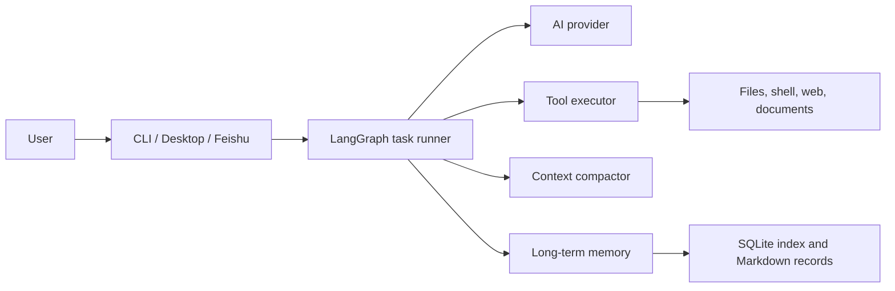

# JCodex

[English](README.md) | [简体中文](README.zh.md)

JCodex is a local-first AI coding and system-automation agent. Describe a goal in natural language and it can plan work, use local tools, request approval for sensitive commands, retain useful project context, and present progress through a terminal, desktop app, or Feishu gateway.

> JCodex executes commands and changes files on your computer. Review permissions and use it only in workspaces you trust.

## Highlights

- **One execution core, three interfaces**: CLI, desktop, and Feishu gateway modes use the same resumable LangGraph workflow.
- **Practical local tools**: shell commands, file reading and editing, code/content search, web search, URL reading, timers, document generation, image viewing, and local project previews.
- **Human control**: potentially sensitive tool calls can pause for explicit approval; structured questions can pause and resume a task safely.
- **Project-aware desktop workspace**: create projects, associate conversations with project folders, attach images and reference folders, inspect modified files, and run managed previews.
- **Context compaction and long-term memory**: compaction keeps active tasks within the model context limit; SQLite-backed retrieval preserves reusable global, workspace, and session knowledge separately.
- **Extensible skills**: bundled and workspace-local `SKILL.md` modules provide reusable operating guidance without adding code to the agent core.

## Architecture



The runner records durable checkpoints for approval and question interrupts. It resumes work from those checkpoints without storing private reasoning. Configuration, provider transport, tool execution, approvals, memory, and UI events remain local project components.

## Requirements

- Python 3.11 or later
- An OpenAI-compatible chat-completions API endpoint and API key
- Optional: a Tavily API key for web search
- Optional: Feishu bot credentials for gateway mode

Pinned runtime dependencies include LangChain, LangGraph, and the LangGraph SQLite checkpointer. See `requirements.txt` for the complete list.

## Installation

```bash
git clone git@github.com:chuanchuan123321/JCodex.git
cd JCodex
python -m venv .venv
source .venv/bin/activate              # Windows: .venv\\Scripts\\activate
pip install -e .
```

Alternatively, install the declared dependencies directly:

```bash
pip install -r requirements.txt
```

## Configuration

Copy the example configuration and set at least the provider endpoint, API key, and model:

```bash
cp .env.example .env
```

```dotenv
API_BASE_URL=https://api.openai.com/v1
API_KEY=your_api_key_here
API_MODEL=your_model_name

# Optional web search
TAVILY_API_KEY=your_tavily_api_key_here
```

Important settings:

| Setting | Default | Purpose |
| --- | --- | --- |
| `MAX_STEPS` | `20` | Maximum tool-execution steps for one task |
| `MAX_TOKENS` | `30000` | Maximum generated tokens per model response |
| `CONTEXT_WINDOW` | `256000` | Model context-window budget used by compaction |
| `AUTO_COMPACT_THRESHOLD_PERCENT` | `85` | Context utilization that triggers compaction |
| `MAX_WEB_SEARCHES` | `3` | Per-task web-search limit |
| `MEMORY_EMBEDDING_MODEL` | empty | Enables optional embedding retrieval; empty uses FTS5/BM25 |
| `MINIBOT_DESKTOP_PORT` | `8000` | Preferred desktop application port |

Never commit `.env`: it can contain credentials and is ignored by default.

## Run JCodex

### Terminal

```bash
python chat.py
```

Use `help` to see terminal commands. `exit` or `quit` closes the session; `Ctrl+C` interrupts the current task.

### Desktop application

```bash
python chat.py desktop
```

The desktop application provides task conversations, project folders, plan mode, file and memory browsers, API configuration, command-approval dialogs, task attachments, and managed local project previews.

By default it opens as a Chrome application window. To open in the system browser instead:

```bash
MINIBOT_DESKTOP_MODE=browser python chat.py desktop
```

### Feishu gateway

```bash
python chat.py gateway
```

Configure these values in `.env` before starting gateway mode:

```dotenv
FEISHU_ENABLED=true
FEISHU_APP_ID=your_feishu_app_id
FEISHU_APP_SECRET=your_feishu_app_secret
```

Enable the bot capability in Feishu Open Platform and subscribe to `im.message.receive_v1`. In gateway mode, JCodex can report progress, request approval, receive answers, and send completed files through Feishu.

## How It Works

1. The interface sends your request to the shared task runner.
2. The model chooses from the available, structured tool schemas.
3. The runner executes the tool, tracks results, and requests approval or user input when required.
4. Near the context limit, the compactor replaces older conversation content with a validated continuation summary.
5. Long-term memory stores and retrieves durable project information independently of compaction.
6. The runner completes, pauses, or resumes from a SQLite checkpoint as appropriate.

## Built-in Tools

| Tool | What it does |
| --- | --- |
| `bash` | Runs terminal commands in a selected working directory |
| `read`, `write`, `edit` | Reads, creates, and precisely edits files |
| `glob`, `grep` | Finds files and searches content |
| `websearch`, `codesearch`, `read_url` | Searches the web, programming references, and URLs |
| `view_image` | Opens image attachments or allowed workspace images |
| `project_preview` | Starts, inspects, opens, and stops managed local previews |
| `generate_pdf` | Produces PDFs from supported source documents |
| `set_timer` | Creates a timed reminder |
| `load_skill` | Loads detailed instructions from a skill module |
| `question` | Pauses for structured user answers |
| `todo_write` | Maintains visible task progress in plan mode |
| `send_file` | Sends a file through the Feishu gateway when that mode is active |

Tool availability can vary by runtime mode and configured services.

## Memory and Context

JCodex uses two complementary systems:

- **Context compaction** protects an active task from exceeding its model context window. It accounts for messages, tool calls, tool results, schemas, and prompts; then replaces older context with a validated summary while preserving the system and current-user instructions.
- **Long-term memory** saves reusable Markdown records and indexes them with SQLite FTS5/BM25. Configure `MEMORY_EMBEDDING_MODEL` to add optional OpenAI-compatible vector retrieval. Global and project memory are durable; session records use a seven-day relevance decay.

Use `/compact` to trigger manual compaction. `/clear` clears the current conversation and execution history.

## Skills

Skills are folders with a `SKILL.md` file and optional scripts or data. JCodex loads their summary automatically and can read the full content only when a task needs it.

- Built-in skills: `agent/skills/`
- Workspace skills: `workspace/skills/`

To add a simple custom skill:

```text
workspace/skills/my-skill/
└── SKILL.md
```

Give the file a name, description, task-specific guidance, and any required environment or command prerequisites.

## Project Layout

```text
JCodex/
├── agent/
│   ├── core/          # Task runner, AI transport, memory, project state
│   ├── tools/         # Local and remote tool implementations
│   ├── channels/      # Feishu gateway integration
│   ├── config/        # Environment-backed configuration
│   ├── skills/        # Built-in skills
│   └── ui/            # CLI and desktop application
├── workspace/         # Runtime output, temporary files, skills, local state
├── tests/             # Automated tests
├── chat.py            # Main entry point
├── .env.example       # Configuration template
├── requirements.txt   # Runtime dependencies
└── README.md          # English documentation
```

Runtime state under `workspace/data`, `workspace/knowledge`, `workspace/memory`, `workspace/preferences`, and `workspace/projects` is intentionally excluded from Git. It can contain local task history and should not be published.

## Development

Run the test suite:

```bash
pytest
```

Run a focused test file:

```bash
pytest tests/test_context_compactor.py
```

Optional quality tools:

```bash
ruff check .
black .
isort .
```

## License

This project is distributed under the [MIT License](LICENSE).
