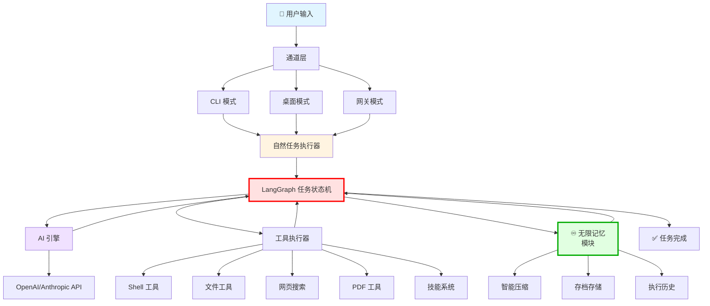
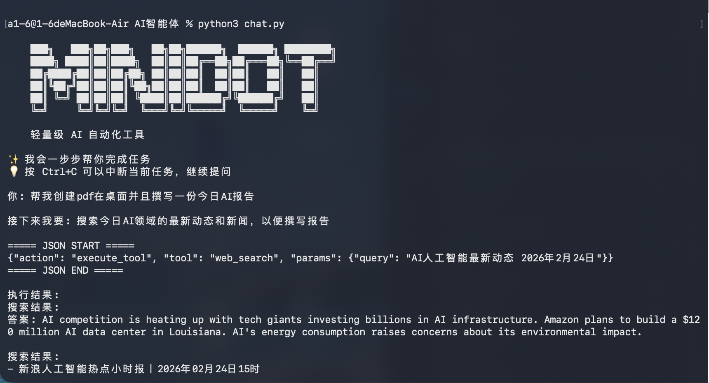
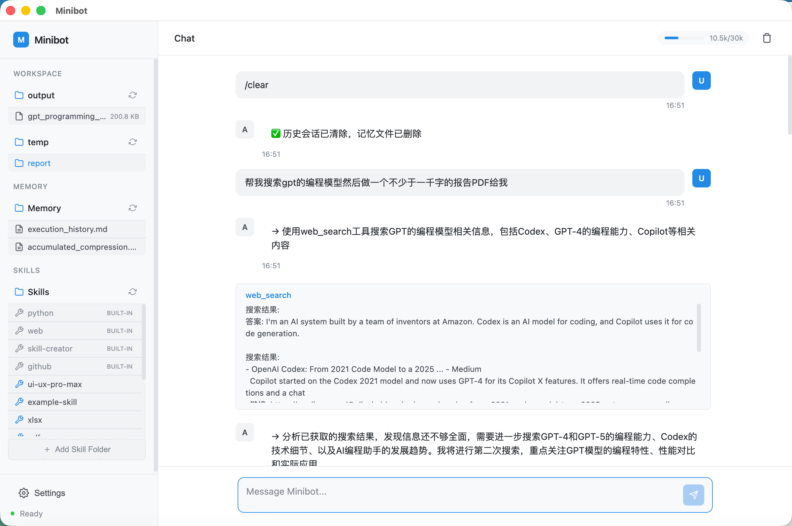

# 🤖 麒麟OS-Agent

<div align="center">


**[English](README.md) | [中文](README.zh.md)**

  

基于原创 SuperAgent 架构的超轻量级 AI 自动化工具，通过自然语言交互执行任务。

[功能特性](#-核心特性) • [安装](#-安装) • [演示截图](#-演示截图) • [文档](#-文档)

</div>

---

## ✨ 概述

麒麟OS-Agent 是基于原创 SuperAgent 架构的超轻量级 AI 自动化工具，通过自然语言交互在终端中执行各种任务。

## 🏗️ 架构设计

终端、桌面和网关模式现在共用一套 LangGraph 任务状态机。LangChain 负责标准
模型与消息抽象，现有 Provider 请求适配、工具、安全审批、记忆与 UI 事件协议
继续由项目自身维护。SQLite 检查点会保留 question/审批中断，但不会保存私有
思考内容。



**🔥 核心创新：**

- **LangGraph 任务状态机**：运行时通过显式状态完成规划、执行、中断、恢复与结束
  - 分析当前状态 → 规划下一步 → 执行工具 → 验证结果 → 继续或结束

- **♾️ 无限记忆模块**：革命性压缩系统实现无限上下文
  - **智能压缩**：97% Token 压缩率（30,000 → 1,000 tokens）
  - **指针式存储**：完整历史存档，随时可访问
  - **三层记忆**：当前任务 → 累积压缩 → 时间戳存档

**核心组件：**
- **通道层**：多模式交互（CLI/桌面/网关）
- **自然任务执行器**：编排多步骤任务规划
- **AI 引擎**：与 LLM API 通信进行推理
- **工具执行器**：执行 20+ 内置工具
- **技能系统**：模块化知识扩展

## 🌟 核心特性

<details>
<summary><b>🚀 核心能力</b></summary>

- 🤖 **自然语言交互** - 用自然语言描述任务
- 🔧 **系统命令执行** - 安全执行 shell 命令
- 📁 **文件操作** - 读写、复制、移动、删除文件
- 📄 **文档解析** - 支持 PDF、Word、Markdown、JSON 格式
- 🔍 **网页搜索** - 使用 Tavily API 搜索网页
- 🌐 **URL 内容读取** - 自动提取网页内容
- ⏰ **定时器** - 设置定时任务

</details>

<details>
<summary><b>🎯 高级功能</b></summary>

- ✅ **命令审批** - 交互式命令确认
- 📤 **文件发送** - 发送文件到飞书（网关模式）
- 💬 **飞书集成** - 实时任务进度更新
- 🖥️ **桌面端界面** - 精美的图形界面
- 🎓 **Skill 系统** - 模块化知识库，包含 6+ 内置 Skill
- 🔄 **智能工具加载** - AI 有意识地按需加载工具
- 🧠 **记忆压缩** - 无限上下文，智能压缩
- ⚡ **24小时工作** - 支持长时间运行

</details>

## 💡 为什么选择 麒麟OS-Agent？

| 特性 | 传统 AI | 麒麟OS-Agent |
|------|---------|---------|
| **能力** | 只能聊天 | 执行真实任务 |
| **控制** | 对话交流 | 控制服务器并执行命令 |
| **上下文** | 有限会话 | 智能压缩，无限上下文 |
| **规划** | 单次响应 | AI 自动多步骤规划 |
| **界面** | 仅网页/App | CLI / 桌面 / 网关 |

**麒麟OS-Agent 填补了空白** - 不仅仅是聊天，而是真正**控制你的服务器**并自主执行任务。

## 安装

### 环境要求

- Python 3.11 或更高版本
- 使用 LangChain 1.2.7 和 LangGraph 1.0.7 作为共享 Agent 运行时
- 使用 LangGraph SQLite Checkpointer 3.1.0 持久化任务状态

支持的框架版本已固定在 `requirements.txt` 和 `setup.py` 中，确保终端、
桌面端和网关模式使用一致的运行环境。

### 从源代码安装

```bash
git clone https://github.com/chuanchuan123321/麒麟OS-Agent.git
cd 麒麟OS-Agent
pip install -e .
```

## 📸 演示截图

### CLI 模式
<p align="center">
  
</p>

### 桌面模式
<p align="center">
  
</p>

### 网关模式（飞书）
<p align="center">
  
</p>

## 🚀 快速开始

### 1️⃣ 配置环境变量

复制 `.env.example` 到 `.env` 并填入你的 API 凭证：

```bash
cp .env.example .env
```

编辑 `.env` 文件，填入你的 API 密钥：

```bash
# 使用 OpenAI API（推荐）
API_BASE_URL=https://api.openai.com/v1
API_KEY=sk-your_openai_api_key_here
API_MODEL=gpt-5.2

# 或使用其他 API 服务（如 Anthropic、国内服务等）
# API_BASE_URL=https://api.anthropic.com
# API_KEY=your_api_key_here
# API_MODEL=claude-sonnet-4-5-20250929

# 或使用国内 API 服务
# API_BASE_URL=https://yunwu.ai
# API_KEY=your_api_key_here
# API_MODEL=claude-sonnet-4-5-20250929

TAVILY_API_KEY=tvly-your_tavily_api_key_here
MAX_TOKENS=4096
TEMPERATURE=0.7
```

**支持的 API 服务：**
- ✅ OpenAI (https://api.openai.com/v1)
- ✅ Anthropic (https://api.anthropic.com)
- ✅ 国内 API 服务 (如 yunwu.ai 等)
- ✅ 其他兼容 OpenAI 格式的 API

### 2️⃣ 运行 麒麟OS-Agent

选择你喜欢的模式：

```bash
# CLI 模式（默认）
python chat.py

# 桌面模式（图形界面）
python chat.py desktop

# 网关模式（飞书集成）
python chat.py gateway
```

### 3️⃣ 网关模式（飞书集成）

在网关模式下运行，从飞书接收任务并发送实时更新：

```bash
python chat.py gateway
```

**网关模式功能：**
- 📨 从飞书接收任务
- 🤖 实时进度更新
- 📤 直接发送文件到飞书
- ✅ 通过飞书进行交互式命令审批

**设置步骤：**
1. 在 `.env` 文件中配置飞书凭证：
   ```bash
   FEISHU_ENABLED=true
   FEISHU_APP_ID=your_app_id
   FEISHU_APP_SECRET=your_app_secret
   ```
2. 在飞书开放平台启用 Bot 能力
3. 订阅 `im.message.receive_v1` 事件
4. 运行：`python chat.py gateway`

### 4️⃣ 桌面模式（图形界面）

在桌面模式下运行，获得精美的图形界面和实时监控：

```bash
python chat.py desktop
```

**桌面模式功能：**
- 🖥️ 现代化轻量级 UI，带侧边栏导航
- 🌓 明暗主题、响应式布局与键盘无障碍操作
- ⏹️ 可靠停止、前端等待队列与任务状态反馈
- 📊 实时 token 使用量监控，可视化指示器
- 📁 工作区文件浏览器（output/temp 文件夹）
- 🧠 记忆文件查看器（execution_history.md、accumulated_compression.md）
- 🎯 Skills 管理（添加、查看、删除自定义 Skill）
- ⚙️ 应用内设置编辑器（修改 API 密钥、模型、参数等）
- ✅ 可视化命令审批对话框
- 💬 聊天界面，显示思考步骤和工具执行结果

桌面端默认使用 Chrome 应用窗口；如需在系统浏览器中打开，可执行：

```bash
MINIBOT_DESKTOP_MODE=browser python chat.py desktop
```

**桌面 UI 组件：**
- **聊天区域**：主对话界面，消息气泡形式
- **Token 指示器**：显示当前内存使用量 vs 压缩阈值
- **侧边栏**：工作区文件、记忆文件、Skills 管理
- **设置弹窗**：配置 API 密钥、模型、最大步数、tokens 等
- **快捷命令**：支持 `/clear` 和 `/compact` 命令

**桌面模式配置：**
点击侧边栏的设置按钮（⚙️）即可配置：
- API Base URL、API Key、API Model
- Tavily API Key
- 最大步数（默认：20）
- 最大 Tokens（默认：30000）
- 压缩阈值（默认：25000）
- 最大搜索次数（默认：3）

## 📚 使用示例

### 示例 1：网页搜索

```
你: 搜索最新的 AI 技术发展

接下来我要: 使用 web_search 工具搜索最新 AI 技术

===== JSON START =====
{"action": "execute_tool", "tool": "web_search", "params": {"query": "latest AI technology 2025"}}
===== JSON END =====
```

### 示例 2：文件操作

```
你: 创建一个 config.json 文件，包含应用配置信息

接下来我要: 创建配置文件

===== JSON START =====
{"action": "execute_tool", "tool": "file_write", "params": {"path": "/path/to/config.json", "content": "{\"app_name\": \"MyApp\", \"version\": \"1.0.0\", \"debug\": true}"}}
===== JSON END =====
```

### 示例 3：多步骤工作流

```
你: 创建一个项目，包含 src、tests 目录和 main.py 文件

接下来我要: 创建项目目录和 main.py 文件

===== JSON START =====
{"action": "execute_tool", "tool": "dir_create", "params": {"path": "/path/to/project/src"}}
===== JSON END =====

（AI 继续创建 tests 目录和 main.py...）
```

## 🛠️ 可用工具

| 工具名 | 描述 | 参数 |
|------|------|------|
| `shell` | 执行系统命令 | `command` |
| `file_read` | 读取文本文件 | `path` |
| `file_write` | 写入文件 | `path`, `content` |
| `file_list` | 列出目录文件 | `path` |
| `file_delete` | 删除文件 | `path` |
| `dir_create` | 创建目录 | `path` |
| `dir_change` | 切换工作目录 | `path` |
| `read_pdf` | 读取 PDF/Word 文档 | `path` |
| `read_markdown` | 读取 Markdown 文件 | `path` |
| `read_json` | 读取 JSON 文件 | `path` |
| `search_files` | 按模式搜索文件 | `pattern`, `path` |
| `get_file_info` | 获取文件信息 | `path` |
| `copy_file` | 复制文件 | `source`, `destination` |
| `move_file` | 移动/重命名文件 | `source`, `destination` |
| `create_file` | 创建新文件 | `path`, `content` |
| `web_search` | 搜索网页 | `query` |
| `read_url` | 读取 URL 内容 | `url` |
| `set_timer` | 设置定时器 | `minutes`, `message` |
| `send_file` | 发送文件到飞书 | `path`（仅网关模式） |
| `generate_pdf` | 从文档生成 PDF | `input_path`, `output_path`, `format` |
| `load_skill` | 加载 Skill 的完整内容 | `skill_name` |

## ⚙️ 配置说明

### API 配置

| 参数 | 说明 |
|------|------|
| `API_BASE_URL` | AI API 的基础 URL |
| `API_KEY` | API 密钥 |
| `API_MODEL` | 使用的模型名称 |
| `TAVILY_API_KEY` | Tavily 搜索 API 密钥 |

### 执行配置

| 参数 | 默认值 | 说明 |
|------|--------|------|
| `MAX_TOKENS` | 30000 | 每次响应的最大 token 数 |
| `TEMPERATURE` | 0.7 | AI 创造力（0-1） |
| `MAX_STEPS` | 20 | 每个任务的最大执行步数 |
| `COMPRESS_AT` | 25000 | 自动压缩的 token 阈值 |
| `MAX_WEB_SEARCHES` | 3 | 每个任务的最大搜索次数 |

### 命令说明

| 命令 | 模式 | 功能 |
|------|------|------|
| `/clear` | CLI、网关、桌面 | 清除对话历史和执行历史 |
| `/compact` | CLI、网关、桌面 | 手动压缩记忆 |
| `/stop` | 网关模式 | 停止当前正在执行的任务 |
| `Ctrl+C` | CLI | 中断当前任务 |
| `exit` / `quit` | CLI | 退出程序 |

## 📁 项目结构

```
麒麟OS-Agent/
├── agent/
│   ├── core/
│   │   ├── ai_engine.py              # AI 引擎
│   │   ├── extended_tool_executor.py # 工具执行器
│   │   ├── skills.py                 # Skills 加载器
│   │   └── memory_manager.py         # 记忆管理器
│   ├── tools/
│   │   ├── shell.py                  # Shell 命令工具
│   │   ├── file.py                   # 文件操作工具
│   │   ├── time_tool.py              # 定时器工具
│   │   ├── pdf_tool.py               # PDF 生成工具
│   │   └── skill_tool.py             # Skill 加载工具
│   ├── channels/
│   │   ├── base.py                   # 通道基类
│   │   ├── feishu.py                 # 飞书集成
│   │   └── manager.py                # 通道管理器
│   ├── bus/
│   │   ├── queue.py                  # 消息队列
│   │   └── events.py                 # 事件定义
│   ├── config/
│   │   ├── loader.py                 # 配置加载器
│   │   └── schema.py                 # 配置模式
│   ├── skills/                       # 内置 Skills
│   │   ├── github/
│   │   ├── web/
│   │   ├── python/
│   │   ├── project-setup/
│   │   └── skill-creator/
│   └── ui/
│       ├── cli.py                    # CLI 界面
│       └── desktop/                  # 桌面端 UI
│           ├── main.py               # Eel 后端（Python）
│           ├── index.html            # UI 布局
│           ├── app.js                # 前端逻辑
│           └── styles.css            # 轻量级主题
├── Memory/
│   ├── execution_history.md          # 当前任务执行历史
│   ├── accumulated_compression.md    # 之前任务的压缩摘要
│   ├── index.json                    # 压缩记录索引
│   └── YYYY-MM-DD/                   # 按日期组织的存档文件夹
│       └── YYYY-MM-DD_HH-MM-SS_历史.md # 时间戳存档
├── workspace/
│   ├── output/                       # 最终输出文件（保留）
│   ├── temp/                         # 临时文件（自动清理）
│   ├── cache/                        # 缓存数据
│   └── skills/                       # 自定义用户 Skills
├── images/                           # 演示截图文件夹
│   └── demo.png                      # 运行界面截图
├── chat.py                           # 主程序
├── setup.py                          # 安装配置
├── requirements.txt                  # 依赖列表
├── .env.example                      # 环境变量示例
├── .gitignore                        # Git 忽略文件
├── CLAUDE.md                         # Claude Code 指导
├── LICENSE                           # 许可证
└── README.md                         # 本文件
```

## 🧠 记忆系统架构

麒麟OS-Agent 拥有一个智能的多层级记忆系统，专为长时间运行的任务设计，能够高效管理上下文：

### 记忆结构

**三层存储策略：**

1. **当前任务历史** (`execution_history.md`)
   - 存储当前任务的实时执行步骤
   - 记录：用户请求、AI 响应、工具执行结果
   - 在任务执行过程中增量追加
   - 压缩后被清空

2. **累积压缩摘要** (`accumulated_compression.md`)
   - 维护所有之前任务的压缩摘要
   - 使 AI 能够理解历史上下文
   - 随着更多任务的压缩而逐步增长
   - 对所有后续任务可用

3. **时间戳存档** (`Memory/YYYY-MM-DD/`)
   - 永久存储完整的执行历史
   - 按日期组织，精确到分钟
   - 支持任务历史查找和审计追踪

### 记忆流程

```
任务执行：
  1. 加载累积压缩摘要（之前任务的摘要）
  2. 在执行过程中追加步骤到执行历史
  3. AI 参考两者进行决策

任务完成：
  1. 将执行历史压缩为摘要（表格格式）
  2. 使用时间戳存档完整历史
  3. 将摘要追加到累积压缩摘要
  4. 清空执行历史为下一个任务做准备

下一个任务：
  1. 加载累积压缩摘要（现在包含最新摘要）
  2. 开始新的执行历史
  3. 循环继续...
```

### 核心特性

- **持久化上下文** - 之前任务的摘要指导当前决策
- **自动清理** - 压缩后执行历史被清空
- **时间组织** - 存档按日期和时间戳组织，便于查找
- **Token 高效** - 系统提示词不被存储，仅存储用户上下文和结果
- **可扩展设计** - 支持无限的任务链接，无需担心上下文丢失

## 无限上下文与智能压缩

麒麟OS-Agent 通过智能压缩机制实现**无限上下文容量**：

**工作原理：**

1. **自动压缩** （手动通过 `/compact` 命令触发）
   - 当任务执行历史超过 30,000 tokens 时，自动触发压缩
   - 或随时通过 `/compact` 命令手动触发
   - 执行历史被智能压缩至约 1,000 tokens 摘要
   - 完整历史被存档，通过指针引用

2. **指针式记忆存储**
   - 压缩摘要存储为：指针 + 完整存档索引
   - 每个任务存储：压缩摘要（~1,000 tokens）+ 完整历史指针
   - 信息完全保留 - 完整历史始终可通过指针访问
   - 累积压缩链仅存储任务引用，无信息丢失

3. **优势对比**

   | 场景 | 不使用压缩 | 使用智能压缩 |
   |------|----------|-----------|
   | 10 个任务链 | 上下文溢出 | ✅ 所有任务均被记住 |
   | 100 个任务链 | 不可能 | ✅ 支持无限任务 |
   | 压缩比率 | N/A | ✅ 30,000 tokens → ~1,000 tokens（97% 压缩率） |
   | 历史回忆 | 几个任务后丢失 | ✅ 完整项目记忆可通过指针访问 |

**使用 `/compact` 命令：**

```bash
# CLI 模式下的手动压缩
> /compact
📊 近期记忆: 28,500 tokens，正在压缩...
✅ 历史记录已压缩并保存到记忆文件

# 或在网关模式下
> /compact
✅ 历史记录已压缩，可继续提问
```

**结果：**
- 任务执行历史被清除
- 压缩摘要被存档
- 之前任务的上下文被累积供下一个任务使用
- 系统可以处理无限的任务序列

## 🎓 Skill 系统

麒麟OS-Agent 包含强大的 Skill 系统，用于模块化知识管理：

### 什么是 Skill？

Skill 是可重用的知识模块，教导 AI 关于特定领域、工具或最佳实践。每个 Skill 包含：
- **SKILL.md** - 详细的指导和示例
- **scripts/** - Python/Shell 脚本用于自动化
- **data/** - CSV 数据库用于搜索和推荐

### 内置 Skill

- **web** - 网页搜索技巧和最佳实践
- **github** - GitHub CLI 使用指南
- **python** - Python 编程最佳实践
- **pdf** - PDF 处理和操作
- **docx** - Word 文档创建和编辑
- **ui-ux-pro-max** - UI/UX 设计智能，包含 50+ 样式和 97 个调色板

### 使用 Skill

1. **查看可用 Skill** - AI 在系统信息中看到所有 Skill
2. **加载 Skill** - AI 调用 `load_skill("skill-name")` 获取详细指导
3. **获得建议** - AI 使用 Skill 数据进行智能推荐

### 创建自定义 Skill

在 `workspace/skills/` 中创建新 Skill：

```bash
mkdir -p workspace/skills/my-skill
cat > workspace/skills/my-skill/SKILL.md << 'EOF'
---
name: my-skill
description: "我的自定义 Skill 描述"
requires_bins: python
requires_env:
---

# 我的 Skill

详细内容和说明...
EOF
```

### 文件管理

麒麟OS-Agent 自动在有组织的目录中管理文件：

```
workspace/
├── output/     # 最终输出文件（保留）
├── temp/       # 临时文件（自动清理）
├── cache/      # 缓存数据（可选清理）
└── skills/     # Skill 模块
```

**规则：**
- 最终输出 → `workspace/output/`
- 临时文件 → `workspace/temp/`（任务完成后自动清理）
- 缓存数据 → `workspace/cache/`
- 系统信息包含所有路径供 AI 参考

## 🤝 贡献

欢迎提交 Issue 和 Pull Request！

## 📄 许可证

本项目采用 MIT 许可证 - 详见 [LICENSE](LICENSE) 文件。

## 📞 联系方式

邮箱: 2774421277@qq.com

---

<div align="center">

**⭐ 如果这个项目对你有帮助，请考虑给个 Star！**

</div>
