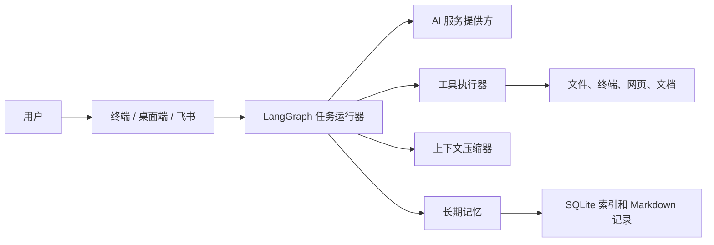

# JCodex

[English](README.md) | [简体中文](README.zh.md)

JCodex 是一个本地优先的 AI 编程与系统自动化智能体。你可以用自然语言描述目标，它会规划任务、调用本地工具、为敏感操作请求审批、保留有用的项目上下文，并通过终端、桌面端或飞书网关展示执行过程。

> JCodex 可以在你的电脑上执行命令和修改文件。请审查权限，并且只在你信任的工作区中使用。

## 核心特点

- **一套执行核心，三种界面**：终端、桌面端和飞书网关共用可恢复的 LangGraph 工作流。
- **实用的本地工具**：支持终端命令、文件读写与编辑、代码和内容搜索、网页搜索、URL 读取、定时器、文档生成、图片查看和本地项目预览。
- **人工掌控**：可能敏感的工具调用会暂停并请求明确审批；结构化问题也可以安全地暂停与恢复任务。
- **面向项目的桌面工作区**：可创建项目、关联项目目录、附加图片和参考文件夹、查看修改文件，并管理本地预览。
- **上下文压缩与长期记忆**：压缩机制让活动任务保持在模型上下文限制内；基于 SQLite 的检索机制独立保存全局、工作区和会话中的可复用知识。
- **可扩展 Skill**：内置和工作区本地的 `SKILL.md` 模块可提供可复用操作指引，无需修改智能体核心代码。

## 架构



任务运行器会为审批和提问中断保存持久检查点，之后可从检查点恢复执行，而不会存储私有推理内容。配置、模型请求适配、工具执行、审批、记忆和 UI 事件协议均由项目本地组件维护。

## 环境要求

- Python 3.11 或更高版本
- 一个兼容 OpenAI Chat Completions 的 API 地址与 API Key
- 可选：用于网页搜索的 Tavily API Key
- 可选：用于网关模式的飞书机器人凭据

项目固定了 LangChain、LangGraph 与 LangGraph SQLite Checkpointer 的运行时版本；完整依赖请参见 `requirements.txt`。

## 安装

```bash
git clone git@github.com:chuanchuan123321/JCodex.git
cd JCodex
python -m venv .venv
source .venv/bin/activate              # Windows: .venv\\Scripts\\activate
pip install -e .
```

也可以直接安装声明的依赖：

```bash
pip install -r requirements.txt
```

## 配置

复制配置示例，并至少设置服务地址、API Key 和模型名称：

```bash
cp .env.example .env
```

```dotenv
API_BASE_URL=https://api.openai.com/v1
API_KEY=your_api_key_here
API_MODEL=your_model_name

# 可选：网页搜索
TAVILY_API_KEY=your_tavily_api_key_here
```

重要配置项：

| 配置项 | 默认值 | 说明 |
| --- | --- | --- |
| `MAX_STEPS` | `20` | 单个任务允许的最大工具执行步数 |
| `MAX_TOKENS` | `30000` | 每次模型响应允许生成的最大 token 数 |
| `CONTEXT_WINDOW` | `256000` | 上下文压缩使用的模型窗口预算 |
| `AUTO_COMPACT_THRESHOLD_PERCENT` | `85` | 触发压缩的上下文占用比例 |
| `MAX_WEB_SEARCHES` | `3` | 每个任务的网页搜索次数上限 |
| `MEMORY_EMBEDDING_MODEL` | 空 | 配置后启用可选的向量检索；为空时使用 FTS5/BM25 |
| `MINIBOT_DESKTOP_PORT` | `8000` | 桌面端首选端口 |

请不要提交 `.env`，它可能包含凭据，项目默认已将其忽略。

## 运行 JCodex

### 终端模式

```bash
python chat.py
```

输入 `help` 查看终端命令；输入 `exit` 或 `quit` 关闭会话，按 `Ctrl+C` 中断当前任务。

### 桌面端

```bash
python chat.py desktop
```

桌面端提供任务会话、项目目录、计划模式、文件与记忆浏览、API 配置、命令审批弹窗、任务附件和受管理的本地项目预览。

默认以 Chrome 应用窗口打开。如需在系统浏览器中打开：

```bash
MINIBOT_DESKTOP_MODE=browser python chat.py desktop
```

### 飞书网关

```bash
python chat.py gateway
```

启动前请在 `.env` 中配置：

```dotenv
FEISHU_ENABLED=true
FEISHU_APP_ID=your_feishu_app_id
FEISHU_APP_SECRET=your_feishu_app_secret
```

在飞书开放平台开启机器人能力并订阅 `im.message.receive_v1` 事件。网关模式下，JCodex 可以通过飞书报告进度、请求审批、接收回答，并发送已完成的文件。

## 工作流程

1. 界面将你的请求发送给共享任务运行器。
2. 模型从可用的结构化工具定义中选择操作。
3. 运行器执行工具、记录结果，并在需要时请求审批或用户输入。
4. 接近上下文限制时，压缩器使用经过校验的续接摘要替换较早的对话内容。
5. 长期记忆独立于压缩机制保存并检索持久的项目信息。
6. 任务运行器会根据状态完成、暂停，或从 SQLite 检查点恢复。

## 内置工具

| 工具 | 作用 |
| --- | --- |
| `bash` | 在指定工作目录执行终端命令 |
| `read`、`write`、`edit` | 读取、创建和精确编辑文件 |
| `glob`、`grep` | 查找文件和搜索内容 |
| `websearch`、`codesearch`、`read_url` | 搜索网页、编程资料和读取 URL |
| `view_image` | 查看任务附件或允许目录中的图片 |
| `project_preview` | 启动、检查、打开和停止受管理的本地预览 |
| `generate_pdf` | 从支持的源文档生成 PDF |
| `set_timer` | 创建定时提醒 |
| `load_skill` | 加载 Skill 模块中的详细指引 |
| `question` | 暂停任务并获取结构化用户回答 |
| `todo_write` | 在计划模式中维护可见任务进度 |
| `send_file` | 网关模式中通过飞书发送文件 |

工具是否可用会因运行模式和已配置服务而变化。

## 记忆与上下文

JCodex 使用两个互补系统：

- **上下文压缩**：防止活动任务超过模型上下文窗口。它会计算消息、工具调用、工具结果、工具定义和提示词，并在保留系统指令和当前用户指令的基础上，用校验后的摘要替换较早上下文。
- **长期记忆**：使用 Markdown 记录保存可复用信息，并通过 SQLite FTS5/BM25 建立索引。配置 `MEMORY_EMBEDDING_MODEL` 后可添加兼容 OpenAI 的向量检索。全局和项目记忆长期保留；会话记录按七天半衰期降低相关性。

使用 `/compact` 手动执行上下文压缩，使用 `/clear` 清除当前对话和执行历史。

## Skills

Skill 是包含 `SKILL.md` 文件及可选脚本或数据的目录。JCodex 会自动读取其摘要，只有在任务需要时才加载完整内容。

- 内置 Skill：`agent/skills/`
- 工作区 Skill：`workspace/skills/`

创建简单自定义 Skill 的目录结构：

```text
workspace/skills/my-skill/
└── SKILL.md
```

在文件中写入名称、描述、任务相关指引，以及必要的环境变量或命令前置条件。

## 项目结构

```text
JCodex/
├── agent/
│   ├── core/          # 任务运行器、模型请求、记忆、项目状态
│   ├── tools/         # 本地和远程工具实现
│   ├── channels/      # 飞书网关集成
│   ├── config/        # 基于环境变量的配置
│   ├── skills/        # 内置 Skills
│   └── ui/            # 终端和桌面端
├── workspace/         # 运行输出、临时文件、Skills、本地状态
├── tests/             # 自动化测试
├── chat.py            # 主入口
├── .env.example       # 配置模板
├── requirements.txt   # 运行依赖
└── README.md          # 英文文档
```

`workspace/data`、`workspace/knowledge`、`workspace/memory`、`workspace/preferences` 与 `workspace/projects` 下的运行状态已被明确排除在 Git 之外，其中可能包含本地任务历史，不应公开发布。

## 开发

运行完整测试：

```bash
pytest
```

运行单个测试文件：

```bash
pytest tests/test_context_compactor.py
```

可选代码质量工具：

```bash
ruff check .
black .
isort .
```

## 许可证

本项目采用 [MIT License](LICENSE) 发布。
