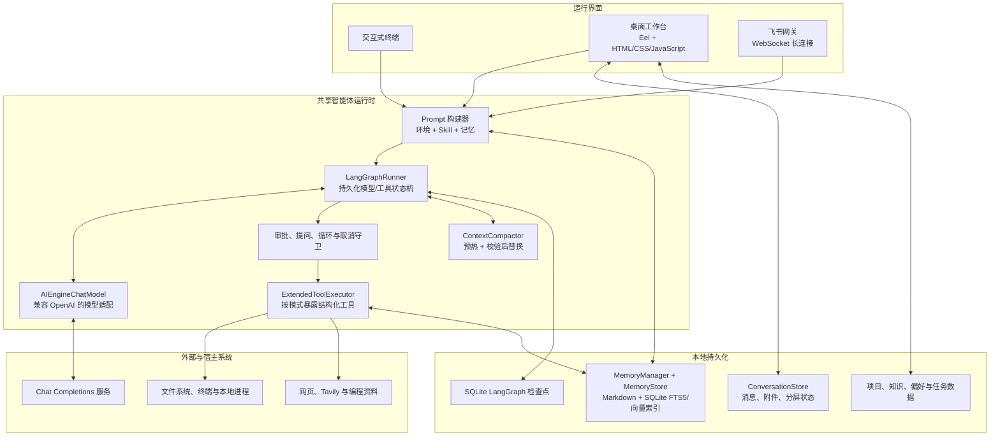
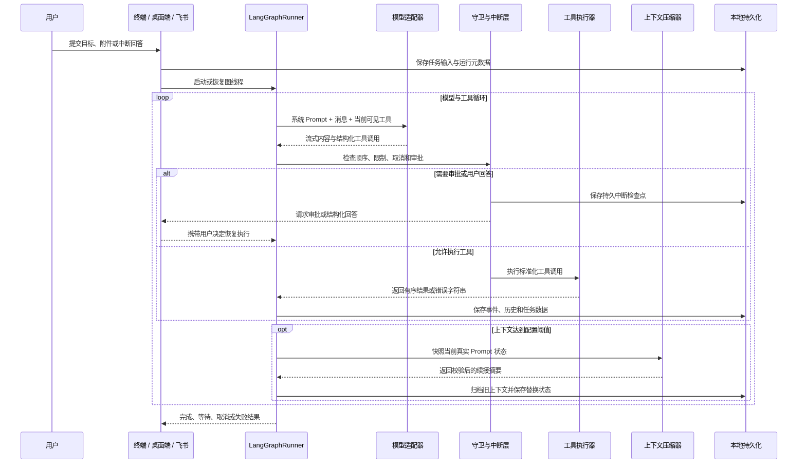
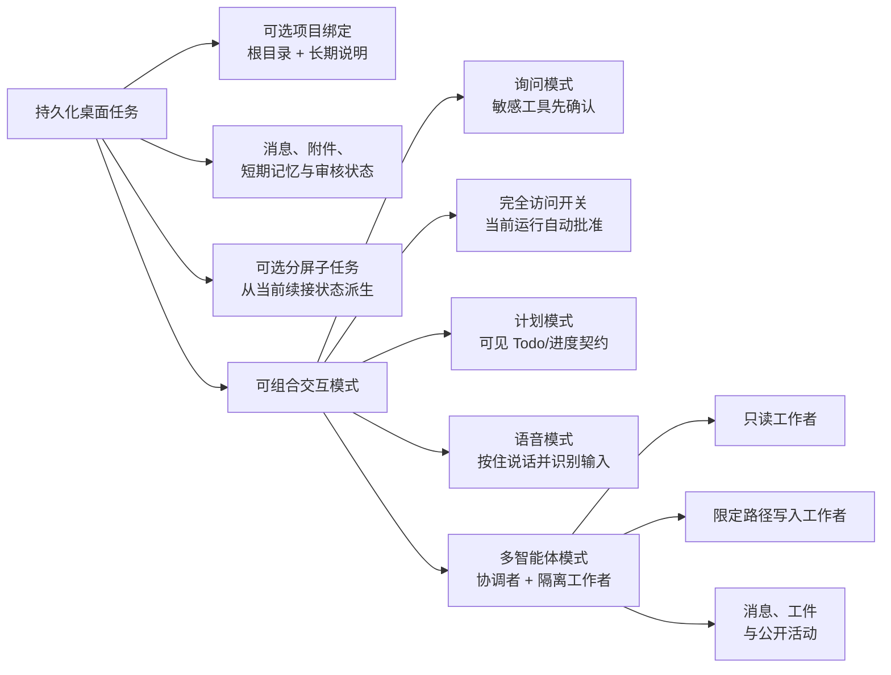
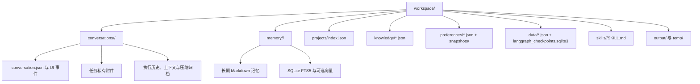
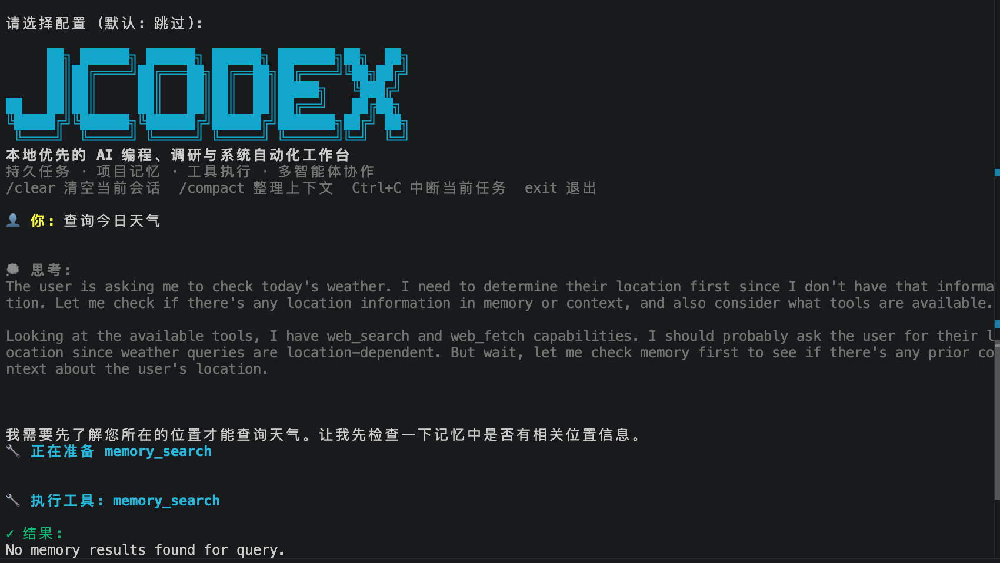
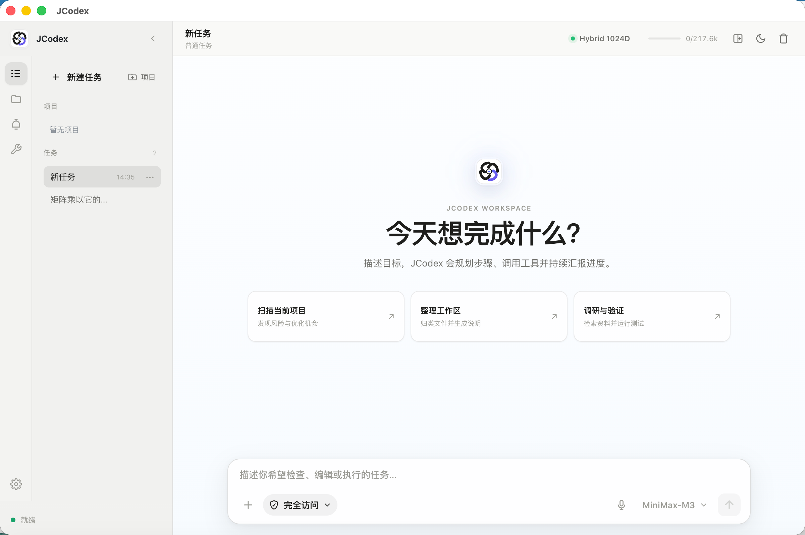
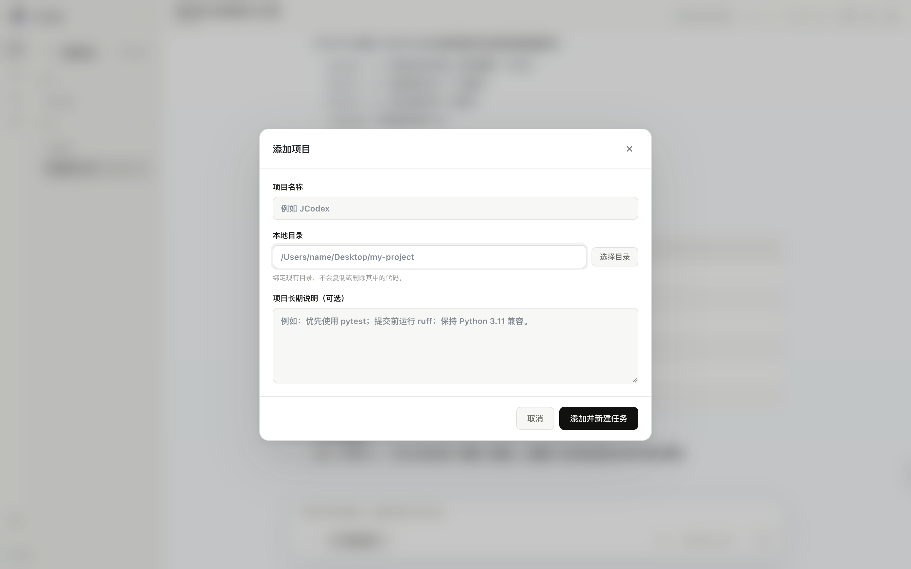
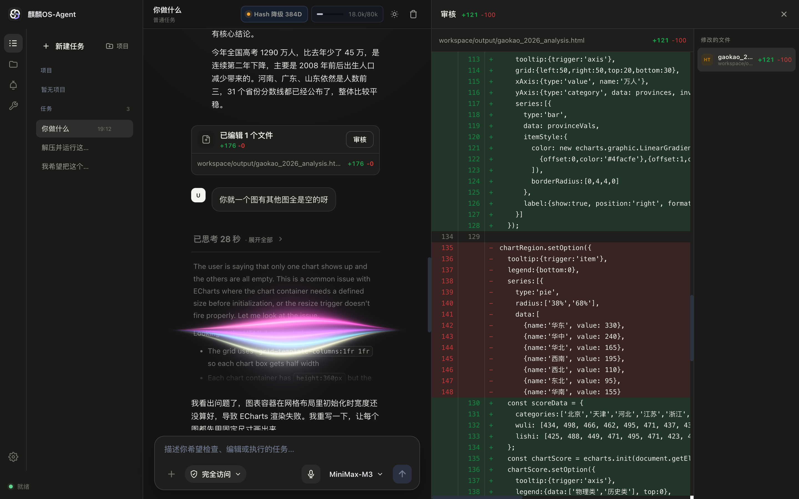
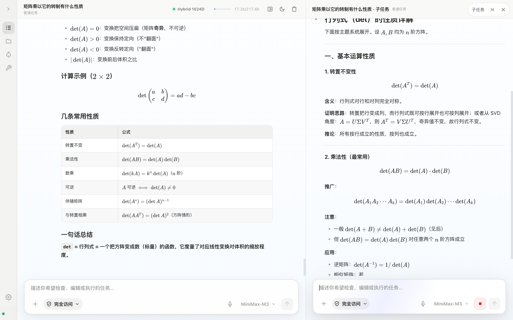
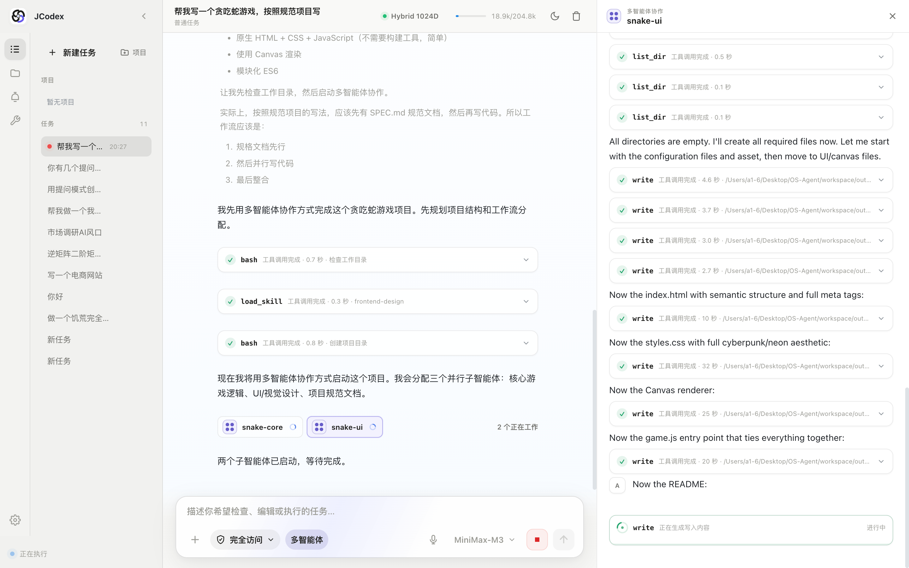

# JCodex

<div align="center">
  
  <p><strong>本地优先的 AI 编程、调研与系统自动化工作台。</strong></p>
  <p>
    <a href="README.md">English</a> ·
    <a href="README.zh.md">简体中文</a>
  </p>
  <p>
    
    
    
  </p>
</div>

JCodex 可以把一个自然语言目标转化为可观察、可暂停、可恢复的执行工作流。它能够检查和修改本地项目、运行命令、搜索代码与网页、处理文档和图片、维护任务计划、协调隔离的子智能体、保存项目记忆，并通过终端、桌面工作台或飞书机器人展示完整执行过程。

它并不是一个简单的聊天界面封装。项目核心是一套持久化 LangGraph 模型/工具循环，并在此基础上实现了审批与提问中断、按模式裁剪的工具清单、上下文压缩、项目级数据隔离、本地预览管理以及多层记忆与知识系统。

> [!WARNING]
> JCodex 能够在宿主电脑上执行命令和修改文件。询问模式属于人工控制层，并不是操作系统沙箱。请只在可信目录中使用，认真检查敏感操作，并妥善保护 `.env`。

## 为什么选择 JCodex

- **一套执行核心，三种运行界面**：终端、桌面端和飞书网关共用模型适配器、工具执行器、LangGraph 状态机、压缩策略与记忆管线。
- **真正的桌面工作台**：支持持久任务、项目目录绑定、分屏子任务、文件与记忆浏览、Skill 管理、改动审核、图片/文件夹附件、本地网页预览、设置、知识库、偏好和数据查看。
- **多种任务交互模式**：普通询问模式、一键完全访问、计划模式、语音模式、多智能体协作以及持久化分屏任务可按需组合。
- **可恢复的人机协作**：命令审批和结构化提问会在图执行中创建检查点；用户作出选择后，系统从同一个任务位置继续执行。
- **面向长任务的上下文管理**：按百分比预热并进行全量替换式压缩，使长时间任务不容易撞上模型上下文上限，同时把短期续接状态与长期记忆明确分开。
- **本地分层记忆**：短期任务文件、SQLite FTS5/BM25 检索、可选 Embedding、结构化知识库、偏好版本和执行数据整合分别承担不同职责。
- **以文件扩展能力**：内置或工作区内的 `SKILL.md` 可以附带流程、脚本和依赖声明，不需要修改智能体执行循环。
- **全过程可见**：推理状态、顺序工具事件、计划、审批、子智能体活动、代码差异、预览生命周期、Token 使用和压缩进度都会被投影为稳定的 UI 事件。

## 功能全景

| 领域 | 已实现能力 |
| --- | --- |
| 编程与本地自动化 | 终端命令、分段文件读取、精确编辑、写入、文件发现、内容搜索、后台任务、输出监测和取消 |
| 调研 | Tavily 网页搜索、编程资料搜索、URL 抓取与正文提取 |
| 文档与媒体 | PDF/Word/Excel 感知读取、PDF 生成、Markdown/JSON 处理、任务级 PNG/JPEG/WebP 图片查看 |
| 任务控制 | 最大步骤、联网搜索次数、工具循环检测、计划/Todo、用户提问、审批、取消、定时器和计划任务 |
| 桌面工作区 | 持久对话、项目绑定、分屏、消息队列、附件、文件浏览、记忆浏览、Skill 浏览、设置、Token/向量状态和深色模式 |
| 审核与预览 | 按任务跟踪修改文件、统一 Diff 审核面板、受管理的本机 Web 服务、内嵌预览、日志、就绪检查和进程回收 |
| 记忆与知识 | 短期执行历史、累计压缩摘要、混合长期检索、知识条目与冲突、偏好与快照、标准化任务数据 |
| 多智能体协作 | 最多四个隔离子智能体、依赖顺序、受限写入所有权、定向消息、共享工件、公开协作黑板、取消和结果汇总 |
| 远程接入 | 飞书 WebSocket 网关、会话隔离、进度推送、中断恢复、文件发送以及 `/stop`、`/clear`、`/compact` |

## 架构设计

### 系统总览



### 单次任务执行链



即使模型在一次响应中返回多个工具调用，运行器也会按顺序执行。检查点以任务/线程为作用域，每次用户提交则有独立的 Run ID。桌面前端接收标准化公开事件，不直接依赖 LangGraph 内部数据结构。

### 桌面任务与交互模式



这些模式不是不同的启动程序，而是改变当前桌面任务的 Prompt 策略、可见工具、审批行为或 UI 交互。非计划模式会隐藏计划工具；语音模式会隐藏提问工具；只有启用多智能体模式时才会暴露协作工具。

### 本地数据模型



这些系统的职责并不重叠：

- **对话存储**用于重建桌面 UI 状态和任务历史。
- **短期记忆**用于续接单个任务，并保存上下文压缩产物。
- **长期记忆**用于检索可复用的全局、工作区和会话知识。
- **知识库**保存有类型、有版本、带冲突信息的结构化条目。
- **偏好系统**保存带历史和快照的用户操作与输出偏好。
- **数据整合**把工具结果、用户事件、配置和任务记录标准化，供桌面端查看。

## 三种运行界面

### 终端模式



*轻量终端界面直接展示流式思考、工具执行、记忆检索与任务中断状态。*

```bash
python chat.py
```

终端模式最轻量，适合直接进行本地自动化，也适合通过 SSH 使用。

| 命令 | 行为 |
| --- | --- |
| `/clear` | 清除当前 CLI 执行历史与记忆上下文 |
| `/compact` | 对累计任务历史执行手动压缩 |
| `exit` 或 `quit` | 退出终端会话 |
| `Ctrl+C` | 取消当前图/工具执行，但不退出 JCodex |

执行 `pip install -e .` 后还会注册 `os-agent` 命令，它同样启动终端界面。

### 桌面工作台



*桌面主页包含任务和项目导航、快捷操作、运行状态、访问模式、语音输入与模型选择。*



*绑定已有本地目录为项目，补充长期项目说明后即可直接创建项目作用域任务，不会复制或修改项目源码。*

```bash
python chat.py desktop
```

桌面运行时只监听 `127.0.0.1`，优先使用配置端口；端口被占用时会向上寻找可用端口。默认以 Chrome 应用窗口启动，也支持：

```bash
# 使用系统默认浏览器打开
MINIBOT_DESKTOP_MODE=browser python chat.py desktop

# 只启动本地服务，不自动打开窗口
MINIBOT_DESKTOP_MODE=server python chat.py desktop
```

桌面端主要工作流：

- 创建持久化普通任务，或把已有本地目录绑定为项目。
- 保存项目长期说明；系统还会发现 `AGENTS.md`、`README.md`、`CONTRIBUTING.md`、`pyproject.toml`、`package.json` 等项目文件。
- 向任务拖入支持的文件、图片或显式本地文件夹引用。
- 任务执行期间继续排队消息、停止执行、清空历史或手动压缩上下文。
- 在主任务旁打开持久化分屏子任务，并保存宽度与显示状态。
- 查看 output/temp 文件、短期记忆文件、Skills、Token 用量和向量引擎状态。
- 在集成 Diff 面板中审核本次任务修改的文件。
- 启动受管理的本地 Web 预览，并在内嵌窗口或外部浏览器打开。
- 管理 API 配置、运行限制、偏好、整合数据和结构化知识。

### 飞书网关模式

```bash
python chat.py gateway
```

网关使用飞书官方 SDK 和 WebSocket 长连接，不需要公网 Webhook 地址。每个聊天拥有隔离的活动任务、待处理中断、记忆与任务数据状态。

必需配置：

```dotenv
FEISHU_ENABLED=true
FEISHU_APP_ID=your_app_id
FEISHU_APP_SECRET=your_app_secret

# 在飞书开放平台配置后可选填写
FEISHU_ENCRYPT_KEY=
FEISHU_VERIFICATION_TOKEN=
```

请在飞书开放平台开启机器人能力并订阅 `im.message.receive_v1`。网关命令：

| 命令 | 行为 |
| --- | --- |
| `/stop` | 取消该聊天正在执行或排队的任务 |
| `/clear` | 只清除该聊天的历史和待执行状态 |
| `/compact` | 只压缩该聊天累计的记忆 |

文件发送等网关专用工具不会出现在本地运行模式中。

## 各种交互模式

### 询问模式与完全访问

桌面任务默认采用需要审批的执行方式。终端命令、写入、编辑、生成文件、启动预览、发送文件以及允许写入的子智能体，都可能暂停图执行并请求确认。“完全访问”开关可以自动批准之后的操作。

完全访问只是不再反复弹出确认，并不会为主智能体增加沙箱或路径隔离，应谨慎开启。

### 计划模式

计划模式会暴露 `todo_write` 与 `update_plan`，向 Prompt 注入计划策略，并在桌面端渲染稳定的任务进度组件。它适合多步骤实现或调研，用来建立用户可见的执行契约，而不只是让模型输出一段计划文字。

### 语音模式



*深色主题同时支持语音输入和集成式代码改动审核面板。*

语音模式使用浏览器的语音识别能力，在桌面浮层中提供按住说话体验，识别文本会在发送前展示。为避免语音任务被依赖点击操作的结构化提问卡阻塞，该次运行不会向模型暴露提问工具。

### 分屏子任务



*主任务与持久化子任务可并排运行，两边拥有独立的续接状态和输入控制。*

一个主桌面任务可以创建一个持久化内部子对话，并在可调宽度的侧栏中运行。创建时会从主任务派生续接记忆，之后两边独立演进。删除分屏子任务时，也会清理它的私有对话状态和相关检查点。

### 多智能体协作



*主任务中展示已分配的子智能体；侧栏显示所选子智能体的公开工具活动和输出。*

启用多智能体模式后，主模型会获得创建和监督最多四个子智能体的协调工具。

- 每个子智能体拥有独立模型历史、LangGraph 运行器、取消事件、收件箱、活动流和长度受限的公开结果。
- 子智能体不会继承主任务的完整私有对话，只接收明确的任务、角色、必要上下文、工作目录、依赖和可选写入路径。
- 只读子智能体适合检查与调研；写入子智能体只获得协调者分配的非重叠目录下的 `edit`/`write`，不会获得 Shell 工具。
- 子智能体不能递归创建更多智能体。
- 智能体之间可以发送定向消息，并向协作黑板发布共享工件。
- 主智能体始终负责集成、最终验证以及交付给用户的答案。

## 核心执行组件

| 组件 | 职责 |
| --- | --- |
| `AIEngine` | 兼容 OpenAI 的 Chat Completions 请求、URL 归一化、重试、SSE 流式解析、推理/工具增量组装与响应解析 |
| `AIEngineChatModel` | LangChain `BaseChatModel` 适配器，在保留现有 Provider 传输行为的同时支持 LangGraph 工具绑定 |
| `LangGraphRunner` | 顺序模型/工具循环、持久状态、中断恢复、取消、步数门控、结束守卫和标准化事件 |
| `ExtendedToolExecutor` | 结构化工具定义、兼容别名、分发、路径/范围校验、后台任务、附件、Skill、计划任务、记忆工具和预览 |
| `ToolLoopGuard` | 在重复或低收益工具调用耗尽步骤预算之前进行阻断 |
| `ContextCompactor` | 真实 Prompt 快照、Token 估算、提前预热、两阶段压缩、结果校验、归档和全量上下文替换 |
| `ConversationStore` | 原子化持久桌面任务、消息、附件、分屏状态、完成状态和任务私有记忆路径 |
| `MemoryStore` | Markdown 长期记忆、SQLite FTS5/BM25、可选 Embedding、时间衰减、去重与可选 MMR |
| `MultiAgentTeam` | 线程安全的子智能体生命周期、依赖、收件箱、工件、公开活动、写入所有权、等待和取消 |
| `PreviewManager` | 持久化本机 Web 进程、环境变量脱敏、Host/Port 注入、就绪检查、限制日志和子进程清理 |

## 工具系统

模型看到的是 JSON Schema 函数工具；实际清单会根据运行界面和交互模式裁剪。

| 分组 | 主要工具 | 说明 |
| --- | --- | --- |
| 文件与代码 | `read`、`glob`、`grep`、`edit`、`write`、`list_dir` | `read` 可识别文本、PDF、Word 和 Excel；大型文本按行限制 |
| 命令与进程 | `bash`、`monitor`、`get_task_output`、`kill_task` | 支持前台/后台进程、取消和轮询输出 |
| 调研 | `websearch`、`codesearch`、`read_url` | Tavily 可选；网页搜索按任务计数 |
| 媒体与文档 | `view_image`、`generate_pdf` | 图片限制为当前任务附件或 workspace/output、workspace/temp 中的允许文件 |
| 计划与交互 | `todo_write`、`update_plan`、`question` | 是否可见取决于计划/语音模式；提问会创建可恢复中断 |
| 记忆与发现 | `memory_search`、`memory_get`、`search_tool`、`use_tool`、`load_skill` | 支持渐进式发现，避免把所有工具和 Skill 细节永久塞进 Prompt |
| 时间与自动化 | `set_timer`、`scheduler_create`、`scheduler_list`、`scheduler_delete`、`update_goal` | 计划任务依赖当前进程存活，并通过已配置回调触发 Prompt |
| 项目预览 | `project_preview` | 只启动本机回环地址服务，并等待 HTTP 就绪 |
| 多智能体 | `spawn_agent`、`list_agents`、`wait_agents`、`send_agent_message`、`publish_agent_artifact`、`get_agent_collaboration`、`cancel_agent` | 仅桌面多智能体模式可见 |
| 网关 | `send_file` | 仅在存在有效网关路由时暴露 |

系统仍注册了一些历史别名，使旧版本持久化检查点能够继续恢复；正常模型工具清单使用推荐名称。

## 记忆、压缩、知识与偏好

### 上下文压缩

压缩解决的是“当前任务如何继续”，并不等同于长期记忆。压缩器会：

1. 从系统 Prompt、消息、工具调用/结果和当前工具 Schema 构建真实快照。
2. 在硬阈值之前按配置提前生成推测性摘要。
3. 达到 `AUTO_COMPACT_THRESHOLD_PERCENT` 后生成并校验结构化续接摘要。
4. 在保留当前指令和审计信息的前提下替换较早图上下文。
5. 归档被替换的原始记录，并向 UI 报告压缩前后 Token。

默认启用两阶段压缩。手动 `/compact` 使用同一套共享机制。

### 长期记忆

`MemoryStore` 会把 Markdown 记录切块后写入工作区专属 SQLite 索引。检索综合文本相关度、可选向量相似度、来源权重和时间衰减。配置兼容 OpenAI 的 Embedding 服务后可开启语义检索；未配置时 FTS5/BM25 仍可正常工作。

桌面项目任务共享项目记忆作用域；普通任务使用隔离作用域；飞书会话按频道/聊天身份隔离。

### 知识库、偏好与任务数据

它们与自动长期记忆检索刻意分离：

- **知识库**保存事实、工作流、案例、模板、规则等有类型条目，以及来源、置信度、版本、关联和冲突记录。
- **偏好系统**保存操作习惯、输出风格、安全策略、AI 行为、工作流或自定义偏好，并支持历史与快照。
- **数据整合模块**把工具结果、用户行为、配置、AI 响应和任务状态标准化为可查看记录。

## Skills 扩展系统

一个 Skill 是包含 `SKILL.md` 和可选脚本、数据的目录：

```text
workspace/skills/my-skill/
├── SKILL.md
├── scripts/
└── data/
```

JCodex 扫描两个位置：

- `agent/skills/`：内置 Skills
- `workspace/skills/`：本地 Skills；同名时覆盖内置版本

Skill Frontmatter 可以声明名称、描述、可选的 `always` 行为与依赖条件。基础 Prompt 只接收精简 Skill 目录，完整指令在需要时通过 `load_skill` 加载。桌面端支持导入、查看、刷新、打开目录和删除工作区 Skill。

## 安装

### 环境要求

- Python 3.11 或更高版本
- 支持 OpenAI 风格 Chat Completions、原生函数/工具调用，最好也支持 SSE 流式返回的模型服务
- 默认桌面应用窗口模式需要 Chrome/Chromium
- 可选：Tavily API Key，用于公共网页搜索
- 可选：飞书应用凭据，用于网关模式
- 可选：兼容 OpenAI 的 Embedding 服务，用于向量记忆

### 从源码安装

```bash
git clone https://github.com/chuanchuan123321/JCodex.git
cd JCodex

python3 -m venv .venv
source .venv/bin/activate
pip install -e .
```

Windows 激活环境：

```powershell
.venv\Scripts\Activate.ps1
pip install -e .
```

也可以只安装依赖：

```bash
pip install -r requirements.txt
```

## 配置

复制模板，并至少设置 API 地址、Key 和模型名称：

```bash
cp .env.example .env
```

```dotenv
API_BASE_URL=https://api.openai.com/v1
API_KEY=your_api_key_here
API_MODEL=your_model_name

MAX_STEPS=100
MAX_TOKENS=50000
CONTEXT_WINDOW=256000
AUTO_COMPACT_THRESHOLD_PERCENT=85
MAX_WEB_SEARCHES=8
```

`API_BASE_URL` 可以包含 `/v1`，JCodex 会归一化常见 Chat Completions 后缀。智谱 BigModel 地址使用 `/v4/chat/completions`，其他 Provider 使用 `/v1/chat/completions`。

### 主要环境变量

下表为本仓库当前使用的默认值或 `.env.example` 模板值。

| 变量 | 默认值 | 作用 |
| --- | ---: | --- |
| `API_BASE_URL` | 取决于服务 | 兼容 OpenAI 的 API Base URL |
| `API_KEY` | 必填 | Provider Bearer Token |
| `API_MODEL` | 回退为 `gpt-4` | 发送给 Provider 的模型标识 |
| `TEMPERATURE` | `0.7` | 采样温度 |
| `MAX_STEPS` | `100` | 单个任务最大模型/工具步骤数 |
| `MAX_TOKENS` | `50000` | 普通模型响应请求的最大生成 Token |
| `CONTEXT_WINDOW` | `.env.example` 为 `256000` | Token 用量和压缩计算使用的上下文预算 |
| `AUTO_COMPACT_THRESHOLD_PERCENT` | `85` | 触发替换式压缩的上下文占用率 |
| `COMPACTION_PREFIRE_LEAD_PERCENT` | `10` | 提前多少个百分点开始推测性摘要 |
| `COMPACTION_TWO_PASS` | `true` | 对大型历史启用分阶段压缩 |
| `COMPACTION_MAX_ATTEMPTS` | `3` | 摘要校验最大尝试次数 |
| `MAX_WEB_SEARCHES` | `8` | 单个任务公共网页搜索次数上限 |
| `TAVILY_API_KEY` | 空 | 配置后启用 Tavily 网页搜索 |
| `MINIBOT_DESKTOP_PORT` | `8000` | 桌面端首选回环端口；被占用时自动寻找下一个 |
| `MINIBOT_DESKTOP_MODE` | `chrome` | 可选 `chrome`、`browser`、`server`、`none` |
| `MEMORY_EMBEDDING_MODEL` | 空 | 配置后启用向量记忆 |
| `MEMORY_EMBEDDING_BASE_URL` | 回退到主 API 地址 | 独立的兼容 OpenAI Embedding 地址 |
| `MEMORY_EMBEDDING_API_KEY` | 回退到主 API Key | 独立 Embedding 凭据 |
| `MEMORY_EMBEDDING_DIMENSIONS` | 模板为 `1024` | 期望向量维度 |
| `MEMORY_VECTOR_WEIGHT` | `0.7` | 混合检索中的向量权重 |
| `MEMORY_TEXT_WEIGHT` | `0.3` | 混合检索中的文本权重 |
| `MEMORY_MMR_ENABLED` | `false` | 是否启用多样性重排 |
| `FEISHU_ENABLED` | `false` | 是否启用飞书通道 |
| `FEISHU_APP_ID` | 空 | 飞书应用 ID |
| `FEISHU_APP_SECRET` | 空 | 飞书应用 Secret |

桌面设置弹窗会修改项目 `.env` 中的主要 Provider、搜索与运行参数。命名 API 配置保存在 `~/.os-agent/configs/`。

## 安全与隔离边界

- 桌面服务与受管理预览只绑定本机回环地址。
- 桌面 RPC 使用会话 Token，并执行同源与 Host 检查；任意本地预览页面不能直接调用 Eel RPC。
- 预览子进程会移除常见的 Secret、Token、Key、Password 等敏感环境变量，再注入受管理的 `HOST`、`PORT` 与预览元数据。
- 任务图片会检查类型与大小，保存到所属对话私有目录，并通过不透明 Asset ID 访问。
- 主智能体敏感工具可创建持久审批；完全访问模式由用户选择绕过这些提示。
- 多智能体写入者只能获得明确且不重叠的目录，执行前会检查修改目标，并且不会暴露 Shell 工具。
- 长期记忆、项目绑定、对话、附件、检查点、偏好和知识默认保存在本地；只有用户选择的工具或网关会显式向外发送数据。
- 模型 Prompt 与被选中的工具结果会发送到配置的 AI Provider；网页与网关工具会访问各自配置的外部服务。

## 项目目录

```text
JCodex/
├── chat.py                         # CLI/网关入口与共享终端运行时
├── Agent.md                        # 主运行行为 Prompt
├── agent/
│   ├── core/
│   │   ├── ai_engine.py            # Provider 传输与流式工具调用解析
│   │   ├── langchain_model.py      # LangChain 适配器
│   │   ├── langgraph_runner.py     # 持久化模型/工具图
│   │   ├── extended_tool_executor.py
│   │   ├── context_compactor.py
│   │   ├── memory_store.py         # 混合长期记忆
│   │   ├── memory_manager.py       # 任务续接文件
│   │   ├── conversation_store.py
│   │   ├── project_store.py
│   │   ├── multi_agent.py
│   │   ├── knowledge_base.py
│   │   └── preference_manager.py
│   ├── tools/                       # Shell、文件、搜索、计划、PDF、预览、Skills
│   ├── channels/                    # 通道抽象与飞书实现
│   ├── bus/                         # 异步入站/出站消息总线
│   ├── config/                      # Pydantic 配置与环境加载
│   ├── skills/                      # 内置 Skills
│   └── ui/
│       ├── cli.py
│       └── desktop/                 # Eel 后端与浏览器前端
├── workspace/
│   ├── conversations/               # 持久桌面任务状态
│   ├── memory/                      # 长期 Markdown 与 SQLite 索引
│   ├── projects/                    # 项目绑定元数据
│   ├── knowledge/                   # 结构化知识库
│   ├── preferences/                 # 偏好历史与快照
│   ├── data/                        # 任务数据与图检查点
│   ├── skills/                      # 用户/工作区 Skills
│   ├── output/                      # 最终生成文件
│   └── temp/                        # 临时文件与预览日志
├── tests/                            # 核心、桌面、记忆、预览与契约测试
├── .env.example
├── requirements.txt
└── setup.py
```

运行目录中可能含有私有 Prompt、附件、本地路径、生成文件和与凭据相关的元数据。它们默认被 Git 忽略，不应未经检查直接发布。

## 扩展 JCodex

### 添加工具

1. 在 `agent/tools/` 中实现工具，或新增 Executor 方法，返回结果字符串或 `ToolExecutionResult`。
2. 在 `ExtendedToolExecutor.get_available_tools()` 中添加 JSON Schema。
3. 在 `ExtendedToolExecutor` 中注册分发逻辑。
4. 明确它是否需要审批、是否只在特定模式或网关出现，以及是否需要修改范围检查。
5. 根据需要补充 Schema 可见性、执行、错误、取消和桌面事件投影测试。

### 添加通道

实现 `BaseChannel`，连接 `MessageBus`，新增配置 Schema，并在 `ChannelManager` 注册。活动任务的会话路由必须保持不可变，避免回复或文件串到其他聊天。

### 添加 Skill

创建 `workspace/skills/<name>/SKILL.md`，写入 Frontmatter 和操作指引；如果流程适合确定性执行，可以在旁边添加脚本或数据。

## 开发与验证

安装可选开发工具：

```bash
pip install pytest pytest-asyncio ruff black isort
```

运行完整测试：

```bash
pytest
```

常用专项测试：

```bash
pytest tests/test_langgraph_runner.py
pytest tests/test_desktop_langgraph.py
pytest tests/test_desktop_frontend_contract.py
pytest tests/test_memory_store.py
pytest tests/test_preview_manager.py
pytest tests/test_multi_agent_core.py
```

检查与格式化：

```bash
ruff check .
black .
isort .
```

桌面前端契约测试会在不启动完整浏览器的情况下检查关键 HTML/JavaScript 行为。涉及可视界面时，还应启动桌面端，手动验证任务切换、审批恢复、分屏、预览、窄屏布局与深色模式。

## 常见问题

| 现象 | 检查项 |
| --- | --- |
| 提示 `API_KEY not found` | 将 `.env.example` 复制为 `.env`，填写 `API_BASE_URL`、`API_KEY`、`API_MODEL` |
| Provider 返回 404 | 传入服务 Base URL，避免重复拼接 `/v1/chat/completions`；确认服务支持 OpenAI 风格工具调用 |
| 工具调用只显示成文字 | 当前模型/Provider 必须返回原生 `tool_calls`，而不只是类似 JSON 的自然语言 |
| 桌面窗口没有打开 | 尝试 `MINIBOT_DESKTOP_MODE=browser`；检查 Chrome/Chromium，并查看终端打印的本机 URL |
| 8000 端口被占用 | JCodex 会自动寻找更高的可用端口，以启动日志中的地址为准 |
| 网页搜索不可用 | 配置 `TAVILY_API_KEY`；编程资料搜索和直接 URL 读取可能仍然可用 |
| 向量状态显示回退 | 配置 Embedding 模型、地址和 Key，或继续使用内置 FTS5/BM25 |
| 飞书收不到消息 | 检查机器人能力、`im.message.receive_v1` 订阅、凭据和 WebSocket 连接日志 |
| 预览命令被拒绝 | 预览服务必须绑定本机回环地址；将 `$HOST`、`$PORT` 传给启动命令，不要使用 `0.0.0.0` |
| 任务一直显示等待 | 检查是否存在审批/提问卡片，作答或停止任务；持久中断本来就会暂停执行 |

## 当前边界

- 目前只实现了飞书远程通道，但通道层可以继续扩展。
- 主智能体使用当前系统用户权限运行；审批能够降低误操作，但不会虚拟化文件系统。
- 语音输入依赖浏览器对语音识别的支持和权限。
- 计划任务属于进程内调度，JCodex 进程停止后不会作为操作系统服务继续运行。
- Provider 兼容性依赖原生 Chat Completions 流式和工具调用行为，不同“兼容 OpenAI”的服务实现质量可能不同。

## 许可证

JCodex 使用 [MIT License](LICENSE) 发布。
